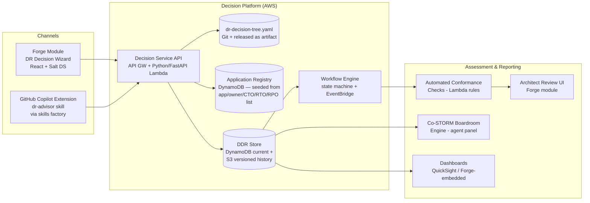

# DR Decision Program — Architecture & Operating Model
### Executing the AWS Multi-Region DR Decision Tree across ~500 Application Teams

---

## 1. The Problem, Restated Precisely

- **Mandate:** every application moves to AWS with a multi-region posture, *regardless of RTO*. This changes Gate 0 of the decision tree: **no application exits at "Multi-AZ only."** The floor for all 500 apps is cross-region Backup & Restore; the tree now only decides *how far above the floor* each app sits.
- **Scale:** ~500 teams must execute the tree. Manual workshops don't scale; self-service with governance does.
- **Consistency:** two intake channels (web application + GitHub Copilot plugin) must produce **byte-identical output schemas**, persisted centrally.
- **Known inputs:** authoritative registry already exists — application, owner, CTO, assigned RTO band, and assigned RPO class (**POF** Point-of-Failure / **SOD** Start-of-Day / **No Recovery**). Both axes pre-assigned means the strategy is a 5×3 matrix lookup for 11 of 15 cells; residual gates exist only in Band 1 and Band 2×SOD.
- **Governance chain:** app owner tracks progress → architects assess → CTOs endorse → CIO consolidates → CFO sees cost.

---

## 2. Core Architectural Principles

### P1 — Decision Tree as Code (single source of truth)
The five-band tree (Gates 0–6) is authored **once** as a versioned, machine-readable spec — `dr-decision-tree.yaml` in a Git repo:

```yaml
tree_version: "2.1.0"
bands:
  - id: band-1
    rto: "< 2h"
    gates:
      - id: q1.1
        prompt: "Is the effective requirement near-zero (<15 min)?"
        type: boolean
        on_true: q1.2
        on_false: q1.3
      - id: q1.2
        prompt: "Can the data layer support multi-region writes?"
        evidence_required: [data_store_inventory]
        on_true: { outcome: ACTIVE_ACTIVE }
        on_false: { outcome: WARM_STANDBY_HOT }
  # ... bands 2–5, gate-3 data checks, gate-4 modifiers
```

Both channels are **thin clients over this one spec**. Neither channel computes the strategy locally.

### P2 — Server-side strategy computation (the consistency guarantee)
Channels collect **gate answers + evidence**; a central **Decision Service** computes the resulting strategy from the versioned tree. Identical answers → identical outcome, always, regardless of channel. Channel drift becomes architecturally impossible.

### P3 — Pre-seeded, confirm-don't-enter
Because RTO band and RPO class are already assigned per application, the tools **pre-populate** them (read-only) from the registry and **pre-compute the expected default strategy from the band × RPO-class matrix**. The team's real work is:
1. Confirm/complete the Gate 3 data-layer inventory (the actual unknown)
2. Declare Gate 4 modifiers
3. Accept the computed strategy **or file a deviation with justification**

This turns a 2-hour workshop into a 20–30 minute guided exercise and makes deviations — the thing architects actually need to scrutinize — first-class objects.

### P4 — Every submission is an immutable, versioned record
Output = a **DR Decision Record (DDR)**, modeled on ADRs: append-only history, one current version, full audit trail. Executives are ultimately consuming aggregations of DDRs.

---

## 3. Canonical Output: the DR Decision Record (DDR)

One JSON Schema, validated at the API boundary. Both channels emit exactly this.

```json
{
  "ddr_version": "1.0",
  "tree_version": "2.1.0",
  "app": {
    "app_id": "APM-04231",              // from registry, immutable
    "name": "…", "owner": "…", "cto_tower": "…",
    "rto_band": "band-2", "rpo_class": "POF"     // pre-seeded, read-only (POF | SOD | NO_RECOVERY)
  },
  "submission": {
    "channel": "webapp | copilot-plugin",
    "submitted_by": "…", "submitted_at": "…",
    "session_transcript_ref": "s3://…"   // Copilot channel only
  },
  "gate_answers": [
    { "gate": "q2.1", "answer": true, "evidence": ["…"] }
  ],
  "data_layer_inventory": [
    { "store": "aurora-postgres", "replication": "aurora-global-db",
      "achievable_rpo": "PT1S", "achievable_rto": "PT2M",
      "meets_target": true }
  ],
  "modifiers": ["compliance:data-residency-eu"],
  "computed_strategy": "PILOT_LIGHT",     // server-computed, non-editable
  "declared_strategy": "WARM_STANDBY",    // what team commits to
  "deviation": {
    "is_deviation": true,
    "direction": "upgrade | downgrade",
    "justification": "…",
    "cost_delta_estimate": "…"
  },
  "cost": { "prod_monthly_estimate": "…", "dr_pct_band": "40-70%" },
  "attestation": { "owner_signed": true, "signed_at": "…" },
  "workflow": { "state": "SUBMITTED", "history": [] },
  "assessment": { /* populated by architect stage, see §6 */ }
}
```

**Design notes**
- `computed_strategy` vs `declared_strategy` split is the analytical heart of the program: agreement = fast-track approval; divergence = deviation workflow. The CFO cost story (§8) is literally a group-by on these two fields.
- `tree_version` pinning means a tree update never silently invalidates prior submissions; re-assessment campaigns are explicit.

---

## 4. System Architecture



### 4.1 Channel A — Web Application (Forge module)
- Ship as a module in **Forge** (your React + TypeScript + Salt DS + Hono/tRPC stack) — no new portal, existing SSO, existing deployment path.
- SSO identity → registry lookup → "here are *your* applications and their status."
- Guided wizard renders directly from `dr-decision-tree.yaml` (schema-driven UI — new tree versions need zero front-end changes).
- Gate 3 rendered as a structured data-store inventory grid with per-store achievable-RPO dropdowns mapped to the capability matrix (Aurora Global DB, DynamoDB GT, RDS CRR, DRS, S3 CRR…).

### 4.2 Channel B — GitHub Copilot Extension
- Generate through your **skills factory**: one `capability.yaml` intent contract → Copilot skill *and* Claude Code plugin (the Agent Skills standard gives you the second channel for free — teams on Claude Code get it too).
- Conversational flow mirrors the wizard gates, but adds the plugin channel's unfair advantage: **repo introspection**. The skill scans Terraform/CDK/Helm in the team's repo to pre-answer Gate 3 (detects `aws_rds_cluster` with `global_cluster_identifier`, DynamoDB table configs, S3 replication rules — plus Gate 3B/3C signals: Terraform providers `mongodbatlas`/`snowflake`, SaaS connection strings and drivers in dependency manifests, VPC endpoint/PrivateLink definitions, KMS key configs, and control-plane-dependent failover patterns in IaC) and presents findings for human confirmation — evidence-grade answers instead of self-reported guesses.
- On completion the skill assembles the DDR JSON, validates against the published schema locally, and submits to the same Decision Service endpoint (GitHub App auth → mapped to registry identity). Optionally also opens a PR committing `ddr.json` to the app repo, so the decision lives beside the code it governs.
- **Hard rule enforced by the factory's eval gate:** the skill contains *no strategy logic* — it may only collect answers and call the API. Add an eval case asserting identical answers via both channels produce identical stored DDRs.

### 4.3 Persistence & Events
- **Registry table** (DynamoDB): seeded once from your existing list; the workflow state per app lives here.
- **Vendor DR Catalog** (DynamoDB + Forge admin UI): architect-maintained capability facts per SaaS vendor/product/edition — what Atlas, Snowflake, Starburst *can* do, edition gates, reference RPO/RTO. DDRs store only the app's configuration against a `catalog_entry_id`. Assess each vendor once, not 200 times; a catalog update triggers targeted re-assessment events for every DDR referencing it.
- **DDR store**: DynamoDB for current record + queries; every version also written to S3 (object-versioned, Object Lock if audit demands immutability).
- **EventBridge** events on every state transition (`ddr.submitted`, `ddr.flagged`, `ddr.approved`, `ddr.cto_endorsed`) → drive notifications (email/Teams/Slack), dashboard refresh, and SLA timers (auto-nudge owners idle > X days).

### 4.4 Workflow State Machine (per application)
```
NOT_STARTED → IN_PROGRESS → SUBMITTED → AUTO_CHECKED
   → ARCHITECT_REVIEW → (REWORK → SUBMITTED)*
   → APPROVED → CTO_ENDORSED → REPORTED
Exception path: DEVIATION_PANEL (Co-STORM session) between
ARCHITECT_REVIEW and APPROVED for flagged/deviating apps.
```

---

## 5. Progress Tracking & Self-Reporting Dashboard

**App-owner view** (Forge page, filtered to their apps): status per app, days-in-state, blockers field (self-reported), due date per wave, "what's next" call to action. Self-attestation checkbox at submission is the accountability anchor.

**Program view** (architects/PMO): funnel chart across workflow states, completion % by CTO tower, aging report (stuck > 14 days), deviation queue depth, channel adoption split.

**Implementation:** QuickSight over the DDR/registry tables (fastest), or Forge-embedded charts via tRPC if you want it fully in-portal. Weekly automated digest email to each CTO tower generated from the same queries.

---

## 6. Architect Assessment Framework (two layers)

### Layer 1 — Automated conformance (runs on every submission, zero architect time)
| Check | Flag raised when |
|---|---|
| Matrix conformance | `declared_strategy` weaker than the band × RPO-class cell default without deviation record |
| RPO-class feasibility | POF app with any store on `backup-copy-only` / `none` (cannot meet point-of-failure) |
| RPO-class over-engineering | SOD app declaring continuous replication (Aurora Global DB, DynamoDB GT…) — CFO cost flag; No Recovery app declaring any replication |
| Mandate floor | any answer implying single-region posture (mandate: none allowed) |
| Evidence completeness | Gate 3 inventory empty / stores marked "unknown" |
| Static stability (3B) | Band-1 / near-zero app whose failover needs a control-plane call (Route 53 API, ASG launch, IAM creation); KMS keys not multi-region; secrets not replicated |
| Region service parity (3B) | A regional service in the inventory is `missing` in the chosen DR region — region pair rejected |
| SaaS correlated failure (3C) | Critical-path SaaS homed in the app's primary region with replication not configured — high severity, defeats the strategy |
| SaaS feasibility (3C) | POF app whose SaaS lacks configured replication; edition below the vendor's DR feature gate; PrivateLink/auth path absent in DR region |
| Effective objectives | Server-computed effective RPO/RTO (worst across 3A + 3C) misses the assigned class/band |
| Cost anomaly | declared strategy ≥ 2 levels above the matrix-cell default (over-engineering) |
| Consistency | deviation direction contradicts justification text (LLM-assisted lint) |

Clean submissions with `computed == declared` → **fast-track** (sample-audit 10%, auto-approve the rest). Architect capacity concentrates on the ~15–25% that flag. This is the only way 500 apps get through a finite architect pool.

### Layer 2 — Human review rubric (Well-Architected dimensions + your additions)
Score each flagged/sampled DDR **1–5 per dimension**, with evidence-quality and confidence ratings:

| Dimension | What the architect asks |
|---|---|
| **Reliability / Resiliency** | Does the strategy truly meet band RTO & RPO? Static stability? Failback plan? Corruption/PITR covered? |
| **Operational Excellence / Operations** | Runbooks exist? Failover automated or manual with owner? Drill cadence committed? Team maturity honest? |
| **Cost Optimization** | Spend proportional to tier? Over/under-engineering? Idle standby justified? |
| **Security** | Secrets/IAM/KMS replicated to DR region? Cross-region data movement compliant? |
| **Performance Efficiency** | DR region capacity/quotas verified? Latency impact of region pair acceptable? |

Verdicts: **Approve / Approve-with-conditions / Rework / Escalate-to-panel.** Scores persist into `assessment` on the DDR — they become the raw material for exec roll-ups.

*Optional:* mirror the rubric as an **AWS Well-Architected Tool custom lens** and push approved DDRs as WA workloads/milestones via API — gives you AWS-native tracking for free without displacing your DDR store as system of record.

### Layer 3 — Co-STORM boardroom panel (for deviations & top-risk apps)
Adapt Co-STORM's discourse protocol into a **challenge panel**:

- **Expert agents** (grounded in the DDR, its evidence, the tree spec, and the WAF): *Chief Architect*, *SRE Lead*, *FinOps Controller*, *Security & Risk Officer* — each interrogates the submission from its lens and answers from evidence.
- **Moderator agent**: surfaces retrieved-but-undiscussed angles — the "question nobody asked" (e.g., "the Kafka mirror RPO was never addressed").
- **Human participants** (real architect, app owner, optionally the CTO delegate) observe or inject steering questions — exactly Co-STORM's observe-or-engage model.
- **Outputs:** transcript + hierarchical mind map of issues + a cited verdict memo, all attached to the DDR as review evidence.

Where it earns its keep: (a) per-app for the ~50–100 deviation/escalation cases, giving every CTO tower a *consistent, documented* challenge process instead of reviewer-lottery; (b) **portfolio level** — run the panel over aggregated DDR data per tower to draft the CTO/CIO/CFO readout narratives with every claim traceable to specific DDRs.

---

## 7. Executive Assessment & Reporting Cascade

Same DDR dataset, three lenses, sequenced CTO → CIO → CFO as you specified:

### CTO (per tower, monthly)
- Heatmap: RTO band × declared strategy for their apps (conformance at a glance)
- Deviation register requiring **their endorsement** (endorsement = workflow state, on the record)
- Completion funnel + aging vs. wave deadlines; top-5 resilience risks (from architect scores)
- Ask of them: endorse deviations, unblock stuck teams, own their tower's date

### CIO (quarterly steering, after CTO sign-offs)
- Firmwide mandate compliance % and trajectory to done
- Portfolio risk posture: distribution of resiliency scores, count of apps whose *data layer cannot meet stated RPO* (the honest-risk number), shared-platform single points of failure surfaced across DDRs; **SaaS concentration & correlated-failure heatmap** (how many Tier-1 apps ride a vendor homed in the primary region)
- Governance health: % fast-tracked vs escalated, drill-commitment coverage
- Ask: arbitrate cross-tower dependencies, approve tree-version changes, own the narrative up

### CFO (with CIO)
- **Projected DR run-rate** by tower: Σ (prod cost estimate × strategy cost band %) — directly computable from DDR fields
- **Cost of deviation**: upgrades above the matrix-cell default = avoidable spend (the SOD-app-with-live-replication pattern is the single biggest recoverable line item) (listed, owned by endorsing CTO); downgrades = quantified residual risk (downtime cost/hour × band RTO)
- **SaaS DR uplift register**: edition upgrades (e.g. Snowflake Business Critical), multi-region node costs (Atlas), cross-region egress — the routinely-forgotten cost line, now computable per DDR
- Phased spend curve aligned to migration waves; unit economics (DR $ per Tier-1 app vs Tier-4 app) to prove the program isn't gold-plating
- Ask: fund the curve, hold towers to the over-engineering register

Each readout is generated (Co-STORM-drafted, architect-edited) from live DDR queries — no manually assembled decks that drift from the data.

---

## 8. Delivery Plan

| Phase | Weeks | Outcome |
|---|---|---|
| **0 — Foundations** | 1–3 | Tree spec YAML + DDR JSON Schema published; registry seeded; Decision Service API + DDR store live |
| **1 — Channel A** | 3–6 | Forge wizard module; workflow engine; owner dashboard v1 |
| **2 — Channel B** | 5–8 | `capability.yaml` → Copilot skill via factory; repo-introspection for Gate 3; dual-channel identity eval gate passing |
| **3 — Pilot** | 8–10 | 10 friendly teams, 5 per channel; measure time-to-complete, flag rate, schema issues; fix tree v2.1 → v2.2 |
| **4 — Waves** | 10–22 | 3 waves (~50 / ~200 / ~250) by CTO tower; office hours; weekly funnel reports; auto-nudges |
| **5 — Assess & report** | rolling | Auto-checks from day 1; architect reviews per wave; Co-STORM panels for deviations; CTO packs monthly, CIO/CFO at wave boundaries |

**Program KPIs:** median completion time < 30 min; ≥ 75% fast-track rate; 100% deviations with endorsement; zero schema divergence between channels; wave deadline attainment.

---

## 9. Key Risks & Mitigations

| Risk | Mitigation |
|---|---|
| Teams game the wizard (answer to get the cheap outcome) | Evidence-required gates; repo-introspection channel; 10% audit of fast-tracked; attestation on record |
| Data-layer answers are guesses | Copilot channel auto-detects from IaC; Gate 3 "unknown" answers hard-flag |
| Architect review becomes the bottleneck | Fast-track + sampling; Co-STORM pre-digests deviations so human review starts from a structured brief |
| Tree changes mid-program | `tree_version` pinning; explicit re-assessment campaigns only for materially affected bands |
| Two channels drift | No client-side logic (P2) + factory eval gate asserting output identity |
| Registry data (RTO/RPO) is wrong | Confirm-don't-enter surfaces disputes early; disputes route to a data-correction workflow, not silent edits |
| Vendor DR claims taken on faith | Vendor DR Catalog requires evidence (attestation, joint failover test dates); `configured` vs `capable` distinction enforced in schema; correlated-failure check is automatic |

---

## 10. Recommended Tech Stack

Anchored to the existing estate: Forge's locked stack, Python platform depth, Harness.io/GitHub Actions/Argo CD pipelines, trunk-based monorepo.

| Layer | Choice | Notes |
|---|---|---|
| **Web channel** | Forge module — React + TS + Salt DS, Hono/tRPC BFF | Wizard rendered schema-driven from the tree YAML; tree updates require no front-end release |
| **Copilot channel** | GitHub Copilot Extension (GitHub App + skillset, TS surface) | Generated from `capability.yaml` via the skills factory (Agent Skills standard) → Claude Code plugin for free |
| **Decision Service** | Python 3.12 + FastAPI + Pydantic v2 on Lambda (Mangum) behind API Gateway | Tree evaluator = pure-Python interpreter over the YAML; no heavyweight rules engine |
| **Contracts** | DDR JSON Schema (2020-12) as single source | Codegen: datamodel-code-generator → Pydantic; json-schema-to-zod → Zod. One schema, both channels, both languages |
| **Data** | DynamoDB single-table (registry + current DDR + workflow state); S3 versioned bucket for immutable DDR history (Object Lock optional); EventBridge for transitions | Access patterns are KV/event-driven; volumes trivial; zero-ops |
| **Analytics** | Glue/Athena over the S3 DDR lake; QuickSight (architect/exec); Forge-embedded Recharts via tRPC (owner view) | Execs get roll-ups in days; owners stay where their call-to-action lives |
| **Identity** | Enterprise IdP OIDC (API GW authorizer) for web; GitHub App installation tokens → registry identity for plugin | |
| **Co-STORM layer** | Python service, Claude via Bedrock, Claude Agent SDK; persona agents + moderator modeled on knowledge-storm's DiscourseManager pattern; grounding retriever (OpenSearch Serverless) over DDR store + tree spec | Borrow the discourse-protocol *pattern*, not the research runtime; Bedrock keeps data residency in-boundary |
| **IaC / CI-CD** | Terraform; Harness.io or GitHub Actions per repo convention; Argo CD for the Forge module | |

**Rationale for the contested calls:** Python over Node for the Decision Service because the tree evaluator and conformance rules are the highest-change-rate code and platform depth is Python — tRPC remains Forge's BFF only, proxying to FastAPI. DynamoDB over Aurora because the workload is key-value and event-driven at trivial volume, with Athena covering all analytical queries. Wrap Claude rather than deploy `knowledge-storm` as-is because the value is its turn-management/moderator/mind-map protocol, not its research-grade runtime.
