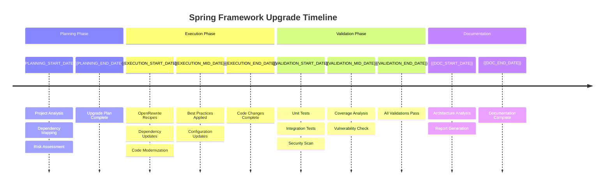
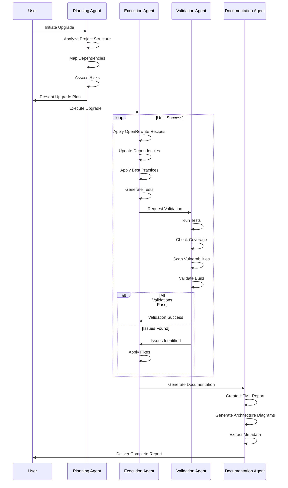

# Enhanced Spring Framework Upgrade System with Documentation Generation

## Overview
This enhanced system not only performs Spring Framework upgrades but also generates comprehensive documentation including architectural artifacts, detailed reports, and visual diagrams using Mermaid DSL.

## System Architecture

```
┌─────────────────┐    ┌──────────────────┐    ┌─────────────────┐    ┌─────────────────┐
│   Planning      │───▶│   Execution      │───▶│   Validation    │───▶│  Documentation  │
│   Agent         │    │   Agent          │    │   Agent         │    │   Generator     │
└─────────────────┘    └──────────────────┘    └─────────────────┘    └─────────────────┘
         │                       │                       │                       │
         ▼                       ▼                       ▼                       ▼
┌─────────────────┐    ┌──────────────────┐    ┌─────────────────┐    ┌─────────────────┐
│ Generate Plan   │    │ Apply Changes    │    │ Run Tests &     │    │ Generate HTML   │
│ Analyze Project │    │ OpenRewrite      │    │ Security Scan   │    │ C4 Diagrams     │
│ Create Timeline │    │ Best Practices   │    │ Coverage Check  │    │ Mermaid DSL     │
└─────────────────┘    └──────────────────┘    └─────────────────┘    └─────────────────┘
```

## Enhanced File Structure

```
spring-upgrade-system/
├── .github/
│   └── copilot/
│       ├── agents/
│       │   ├── spring-upgrade-planner.yml
│       │   ├── spring-upgrade-executor.yml
│       │   ├── spring-upgrade-validator.yml
│       │   └── documentation-generator.yml
│       └── workflows/
│           └── spring-upgrade-enhanced.yml
├── upgrade-config/
│   ├── openrewrite/
│   │   ├── rewrite.yml
│   │   └── custom-recipes/
│   │       └── spring-modernization.yml
│   ├── rules/
│   │   ├── upgrade-rules.json
│   │   ├── quality-gates.yml
│   │   └── documentation-rules.yml
│   └── templates/
│       ├── report-template.html
│       ├── architecture-template.html
│       └── mermaid-templates/
├── scripts/
│   ├── upgrade-orchestrator-enhanced.sh
│   ├── validate-upgrade.sh
│   ├── generate-documentation.sh
│   └── extract-metadata.sh
├── docs/
│   ├── upgrade-guide.md
│   └── troubleshooting.md
└── output/
    ├── reports/
    ├── diagrams/
    └── artifacts/
```

## Enhanced Agent Configurations

### Documentation Generator Agent (`documentation-generator.yml`)
```yaml
name: documentation-generator
description: Generates comprehensive documentation and architectural artifacts
version: 1.0

capabilities:
  - html-report-generation
  - mermaid-diagram-creation
  - metadata-extraction
  - architecture-analysis

instructions: |
  You are a documentation generation specialist for Spring Framework upgrades. Your role is to:
  
  1. **HTML Report Generation**:
     - Create structured HTML reports with embedded Mermaid diagrams
     - Include upgrade plan, execution timeline, and validation results
     - Generate change summaries and file modification lists
     - Embed metadata from application properties and README
  
  2. **Architecture Documentation**:
     - Generate C4 Context and Container diagrams
     - Create sequence diagrams for key workflows
     - Generate class diagrams for upgraded components
     - Create state diagrams for application lifecycle
  
  3. **Metadata Extraction**:
     - Parse application.properties/yml for configuration metadata
     - Extract README.md content and structure
     - Analyze project structure and dependencies
     - Generate component inventory
  
  4. **Visualization**:
     - Create timeline diagrams in Mermaid DSL
     - Generate execution sequence diagrams
     - Produce visual change summaries
     - Create architectural overview diagrams

tools:
  - html-generator
  - mermaid-renderer
  - metadata-parser
  - diagram-creator

output_formats:
  - structured_html
  - mermaid_dsl
  - json_metadata
  - markdown_reports

templates:
  - upgrade_report_template
  - architecture_template
  - timeline_template
  - sequence_template
```

### Enhanced Planning Agent (`spring-upgrade-planner.yml`)
```yaml
name: spring-upgrade-planner
description: Enhanced planning with timeline and documentation generation
version: 2.0

capabilities:
  - project-analysis
  - dependency-mapping
  - risk-assessment
  - plan-generation
  - timeline-creation
  - metadata-extraction

instructions: |
  You are an enhanced Spring Framework upgrade planning specialist. Your role includes:
  
  1. **Comprehensive Project Analysis**:
     - Scan project structure and identify current Spring version
     - Map all dependencies and their compatibility matrix
     - Identify deprecated APIs, patterns, and configurations
     - Extract metadata from application.properties/yml
     - Analyze README.md for project context
  
  2. **Enhanced Plan Generation**:
     - Create detailed step-by-step upgrade plan
     - Generate timeline with milestones and dependencies
     - Estimate effort and complexity for each phase
     - Define rollback strategies and checkpoints
  
  3. **Documentation Preparation**:
     - Prepare data structures for report generation
     - Create baseline architecture documentation
     - Generate initial Mermaid diagram templates
     - Extract project metadata for reporting

tools:
  - file-analysis
  - dependency-scanner
  - version-comparator
  - timeline-generator
  - metadata-extractor

output_artifacts:
  - upgrade-plan.json
  - timeline-data.json
  - project-metadata.json
  - baseline-architecture.json
```

## Documentation Templates

### HTML Report Template (`templates/report-template.html`)
```html
<!DOCTYPE html>
<html lang="en">
<head>
    <meta charset="UTF-8">
    <meta name="viewport" content="width=device-width, initial-scale=1.0">
    <title>Spring Framework Upgrade Report</title>
    <script src="https://cdn.jsdelivr.net/npm/mermaid@10.6.1/dist/mermaid.min.js"></script>
    <style>
        :root {
            --primary-color: #2c3e50;
            --secondary-color: #3498db;
            --success-color: #27ae60;
            --warning-color: #f39c12;
            --danger-color: #e74c3c;
            --light-bg: #ecf0f1;
        }
        
        * {
            margin: 0;
            padding: 0;
            box-sizing: border-box;
        }
        
        body {
            font-family: 'Segoe UI', Tahoma, Geneva, Verdana, sans-serif;
            line-height: 1.6;
            color: var(--primary-color);
            background-color: #f8f9fa;
        }
        
        .container {
            max-width: 1200px;
            margin: 0 auto;
            padding: 20px;
        }
        
        .header {
            background: linear-gradient(135deg, var(--primary-color), var(--secondary-color));
            color: white;
            padding: 2rem;
            margin-bottom: 2rem;
            border-radius: 10px;
            box-shadow: 0 4px 6px rgba(0,0,0,0.1);
        }
        
        .header h1 {
            font-size: 2.5rem;
            margin-bottom: 0.5rem;
        }
        
        .header .subtitle {
            font-size: 1.2rem;
            opacity: 0.9;
        }
        
        .section {
            background: white;
            margin-bottom: 2rem;
            padding: 2rem;
            border-radius: 10px;
            box-shadow: 0 2px 4px rgba(0,0,0,0.1);
        }
        
        .section h2 {
            color: var(--primary-color);
            border-bottom: 3px solid var(--secondary-color);
            padding-bottom: 0.5rem;
            margin-bottom: 1.5rem;
        }
        
        .metrics-grid {
            display: grid;
            grid-template-columns: repeat(auto-fit, minmax(200px, 1fr));
            gap: 1rem;
            margin-bottom: 2rem;
        }
        
        .metric-card {
            background: var(--light-bg);
            padding: 1.5rem;
            border-radius: 8px;
            text-align: center;
            border-left: 4px solid var(--secondary-color);
        }
        
        .metric-card.success {
            border-left-color: var(--success-color);
        }
        
        .metric-card.warning {
            border-left-color: var(--warning-color);
        }
        
        .metric-card.danger {
            border-left-color: var(--danger-color);
        }
        
        .metric-value {
            font-size: 2rem;
            font-weight: bold;
            margin-bottom: 0.5rem;
        }
        
        .metric-label {
            color: #666;
            font-size: 0.9rem;
        }
        
        .change-list {
            background: #f8f9fa;
            border-radius: 8px;
            padding: 1rem;
        }
        
        .change-item {
            display: flex;
            align-items: center;
            padding: 0.5rem 0;
            border-bottom: 1px solid #dee2e6;
        }
        
        .change-item:last-child {
            border-bottom: none;
        }
        
        .change-type {
            display: inline-block;
            padding: 0.25rem 0.5rem;
            border-radius: 4px;
            font-size: 0.8rem;
            font-weight: bold;
            margin-right: 1rem;
            min-width: 80px;
            text-align: center;
        }
        
        .change-type.added {
            background: #d4edda;
            color: #155724;
        }
        
        .change-type.modified {
            background: #fff3cd;
            color: #856404;
        }
        
        .change-type.removed {
            background: #f8d7da;
            color: #721c24;
        }
        
        .mermaid {
            background: white;
            border-radius: 8px;
            padding: 1rem;
            margin: 1rem 0;
        }
        
        .metadata-grid {
            display: grid;
            grid-template-columns: repeat(auto-fill, minmax(300px, 1fr));
            gap: 1rem;
        }
        
        .metadata-section {
            background: var(--light-bg);
            padding: 1rem;
            border-radius: 8px;
        }
        
        .metadata-section h4 {
            color: var(--primary-color);
            margin-bottom: 0.5rem;
        }
        
        .property-list {
            font-family: 'Consolas', monospace;
            font-size: 0.9rem;
        }
        
        .property-item {
            display: flex;
            justify-content: space-between;
            padding: 0.25rem 0;
            border-bottom: 1px solid #ddd;
        }
        
        .property-key {
            font-weight: bold;
            color: var(--primary-color);
        }
        
        .property-value {
            color: #666;
        }
        
        .nav-tabs {
            display: flex;
            border-bottom: 1px solid #dee2e6;
            margin-bottom: 1rem;
        }
        
        .nav-tab {
            padding: 0.75rem 1rem;
            background: none;
            border: none;
            cursor: pointer;
            border-bottom: 2px solid transparent;
            transition: all 0.3s ease;
        }
        
        .nav-tab.active {
            border-bottom-color: var(--secondary-color);
            color: var(--secondary-color);
            font-weight: bold;
        }
        
        .tab-content {
            display: none;
        }
        
        .tab-content.active {
            display: block;
        }
        
        @media print {
            body { background: white; }
            .section { box-shadow: none; border: 1px solid #ddd; }
        }
    </style>
</head>
<body>
    <div class="container">
        <!-- Header Section -->
        <div class="header">
            <h1>Spring Framework Upgrade Report</h1>
            <div class="subtitle">
                Project: {{PROJECT_NAME}} | From: {{OLD_VERSION}} → To: {{NEW_VERSION}} | Date: {{UPGRADE_DATE}}
            </div>
        </div>

        <!-- Executive Summary -->
        <div class="section">
            <h2>Executive Summary</h2>
            <div class="metrics-grid">
                <div class="metric-card {{OVERALL_STATUS_CLASS}}">
                    <div class="metric-value">{{OVERALL_STATUS}}</div>
                    <div class="metric-label">Overall Status</div>
                </div>
                <div class="metric-card {{COVERAGE_STATUS_CLASS}}">
                    <div class="metric-value">{{TEST_COVERAGE}}%</div>
                    <div class="metric-label">Test Coverage</div>
                </div>
                <div class="metric-card {{VULNERABILITY_STATUS_CLASS}}">
                    <div class="metric-value">{{VULNERABILITY_COUNT}}</div>
                    <div class="metric-label">Vulnerabilities</div>
                </div>
                <div class="metric-card {{DURATION_STATUS_CLASS}}">
                    <div class="metric-value">{{UPGRADE_DURATION}}</div>
                    <div class="metric-label">Duration</div>
                </div>
            </div>
        </div>

        <!-- Upgrade Plan and Timeline -->
        <div class="section">
            <h2>Upgrade Plan & Timeline</h2>
            
            <div class="nav-tabs">
                <button class="nav-tab active" onclick="showTab('plan-text')">Plan Overview</button>
                <button class="nav-tab" onclick="showTab('timeline-diagram')">Timeline</button>
            </div>
            
            <div id="plan-text" class="tab-content active">
                <div class="plan-overview">
                    {{UPGRADE_PLAN_TEXT}}
                </div>
            </div>
            
            <div id="timeline-diagram" class="tab-content">
                <div class="mermaid">
                    {{TIMELINE_MERMAID}}
                </div>
            </div>
        </div>

        <!-- Execution Sequence -->
        <div class="section">
            <h2>Execution Sequence</h2>
            <div class="mermaid">
                {{EXECUTION_SEQUENCE_MERMAID}}
            </div>
        </div>

        <!-- Changes Made -->
        <div class="section">
            <h2>Changes Made</h2>
            <div class="change-list">
                {{CHANGES_LIST}}
            </div>
        </div>

        <!-- Validation Results -->
        <div class="section">
            <h2>Validation Results</h2>
            <div class="nav-tabs">
                <button class="nav-tab active" onclick="showTab('test-results')">Test Results</button>
                <button class="nav-tab" onclick="showTab('security-scan')">Security Scan</button>
                <button class="nav-tab" onclick="showTab('quality-metrics')">Quality Metrics</button>
            </div>
            
            <div id="test-results" class="tab-content active">
                {{TEST_RESULTS_HTML}}
            </div>
            
            <div id="security-scan" class="tab-content">
                {{SECURITY_RESULTS_HTML}}
            </div>
            
            <div id="quality-metrics" class="tab-content">
                {{QUALITY_METRICS_HTML}}
            </div>
        </div>

        <!-- Project Metadata -->
        <div class="section">
            <h2>Project Metadata</h2>
            <div class="metadata-grid">
                <div class="metadata-section">
                    <h4>Application Properties</h4>
                    <div class="property-list">
                        {{APPLICATION_PROPERTIES_HTML}}
                    </div>
                </div>
                <div class="metadata-section">
                    <h4>README Information</h4>
                    <div>
                        {{README_CONTENT_HTML}}
                    </div>
                </div>
            </div>
        </div>

        <!-- Architecture Documentation -->
        <div class="section">
            <h2>Architecture Documentation</h2>
            
            <div class="nav-tabs">
                <button class="nav-tab active" onclick="showTab('c4-context')">C4 Context</button>
                <button class="nav-tab" onclick="showTab('c4-container')">C4 Container</button>
                <button class="nav-tab" onclick="showTab('sequence-diagram')">Sequence</button>
                <button class="nav-tab" onclick="showTab('class-diagram')">Class</button>
                <button class="nav-tab" onclick="showTab('state-diagram')">State</button>
            </div>
            
            <div id="c4-context" class="tab-content active">
                <h3>C4 Context Diagram</h3>
                <div class="mermaid">
                    {{C4_CONTEXT_MERMAID}}
                </div>
            </div>
            
            <div id="c4-container" class="tab-content">
                <h3>C4 Container Diagram</h3>
                <div class="mermaid">
                    {{C4_CONTAINER_MERMAID}}
                </div>
            </div>
            
            <div id="sequence-diagram" class="tab-content">
                <h3>Sequence Diagram</h3>
                <div class="mermaid">
                    {{SEQUENCE_DIAGRAM_MERMAID}}
                </div>
            </div>
            
            <div id="class-diagram" class="tab-content">
                <h3>Class Diagram</h3>
                <div class="mermaid">
                    {{CLASS_DIAGRAM_MERMAID}}
                </div>
            </div>
            
            <div id="state-diagram" class="tab-content">
                <h3>State Diagram</h3>
                <div class="mermaid">
                    {{STATE_DIAGRAM_MERMAID}}
                </div>
            </div>
        </div>
    </div>

    <script>
        // Initialize Mermaid
        mermaid.initialize({ 
            startOnLoad: true,
            theme: 'default',
            themeVariables: {
                primaryColor: '#3498db',
                primaryTextColor: '#2c3e50',
                primaryBorderColor: '#2c3e50',
                lineColor: '#34495e'
            }
        });

        // Tab functionality
        function showTab(tabId) {
            // Hide all tab contents
            document.querySelectorAll('.tab-content').forEach(content => {
                content.classList.remove('active');
            });
            
            // Remove active class from all tabs
            document.querySelectorAll('.nav-tab').forEach(tab => {
                tab.classList.remove('active');
            });
            
            // Show selected tab content
            document.getElementById(tabId).classList.add('active');
            
            // Add active class to clicked tab
            event.target.classList.add('active');
        }

        // Print functionality
        function printReport() {
            window.print();
        }
    </script>
</body>
</html>
```

### Mermaid Templates (`templates/mermaid-templates/`)

#### Timeline Template (`timeline-template.mmd`)


#### Execution Sequence Template (`execution-sequence-template.mmd`)


## Enhanced Scripts

### Documentation Generator Script (`scripts/generate-documentation.sh`)
```bash
#!/bin/bash

set -e

PROJECT_DIR=${1:-"."}
REPORT_DIR=${2:-"upgrade-reports"}
OUTPUT_DIR="output"

# Colors for output
BLUE='\033[0;34m'
GREEN='\033[0;32m'
YELLOW='\033[1;33m'
NC='\033[0m'

log() {
    echo -e "${BLUE}[$(date +'%Y-%m-%d %H:%M:%S')] $1${NC}"
}

success() {
    echo -e "${GREEN}[SUCCESS] $1${NC}"
}

warn() {
    echo -e "${YELLOW}[WARNING] $1${NC}"
}

# Create output directories
mkdir -p "$OUTPUT_DIR"/{reports,diagrams,artifacts}

log "Starting documentation generation..."

# Extract project metadata
log "Extracting project metadata..."
./scripts/extract-metadata.sh "$PROJECT_DIR" "$OUTPUT_DIR/artifacts/metadata.json"

# Generate architecture diagrams using Copilot
log "Generating architecture diagrams..."
gh copilot agent documentation-generator \
    --project-dir "$PROJECT_DIR" \
    --task "generate-architecture" \
    --output "$OUTPUT_DIR/diagrams"

# Generate HTML report
log "Generating HTML report..."
gh copilot agent documentation-generator \
    --project-dir "$PROJECT_DIR" \
    --task "generate-html-report" \
    --template "upgrade-config/templates/report-template.html" \
    --data "$REPORT_DIR" \
    --metadata "$OUTPUT_DIR/artifacts/metadata.json" \
    --output "$OUTPUT_DIR/reports/upgrade-report.html"

# Generate individual Mermaid diagrams
log "Generating Mermaid diagrams..."

# Timeline diagram
gh copilot agent documentation-generator \
    --task "generate-timeline" \
    --data "$REPORT_DIR/timeline-data.json" \
    --template "upgrade-config/templates/mermaid-templates/timeline-template.mmd" \
    --output "$OUTPUT_DIR/diagrams/timeline.mmd"

# Execution sequence diagram
gh copilot agent documentation-generator \
    --task "generate-sequence" \
    --data "$REPORT_DIR/execution-log.json" \
    --template "upgrade-config/templates/mermaid-templates/execution-sequence-template.mmd" \
    --output "$OUTPUT_DIR/diagrams/execution-sequence.mmd"

# C4 Context diagram
gh copilot agent documentation-generator \
    --task "generate-c4-context" \
    --project-data "$OUTPUT_DIR/artifacts/metadata.json" \
    --output "$OUTPUT_DIR/diagrams/c4-context.mmd"

# C4 Container diagram
gh copilot agent documentation-generator \
    --task "generate-c4-container" \
    --project-data "$OUTPUT_DIR/artifacts/metadata.json" \
    --output "$OUTPUT_DIR/diagrams/c4-container.mmd"

# Class diagram
gh copilot agent documentation-generator \
    --task "generate-class-diagram" \
    --project-dir "$PROJECT_DIR" \
    --output "$OUTPUT_DIR/diagrams/class-diagram.mmd"

# State diagram
gh copilot agent documentation-generator \
    --task "generate-state-diagram" \
    --project-dir "$PROJECT_DIR" \
    --output "$OUTPUT_DIR/diagrams/state-diagram.mmd"

# Generate summary artifacts
log "Generating summary artifacts..."
gh copilot agent documentation-generator \
    --task "generate-summary" \
    --report-dir "$REPORT_DIR" \
    --output "$OUTPUT_DIR/artifacts/upgrade-summary.json"

success "Documentation generation completed!"
log "Reports available in: $OUTPUT_DIR/reports/"
log "Diagrams available in: $OUTPUT_DIR/diagrams/"
log "Artifacts available in: $OUTPUT_DIR/artifacts/"
```

### Metadata Extraction Script (`scripts/extract-metadata.sh`)
```bash
#!/bin/bash

set -e

PROJECT_DIR=${1:-"."}
OUTPUT_FILE=${2:-"metadata.json"}

log() {
    echo -e "\033[0;34m[$(date +'%Y-%m-%d %H:%M:%S')] $1\033[0m"
}

log "Extracting project metadata from $PROJECT_DIR"

# Initialize metadata JSON
cat > "$OUTPUT_FILE" << 'EOF'
{
  "project": {
    "name": "",
    "description": "",
    "version": "",
    "structure": {},
    "dependencies": {},
    "configuration": {},
    "readme": {}
  },
  "upgrade": {
    "timestamp": "",
    "from_version": "",
    "to_version": "",
    "changes": []
  }
}
EOF

# Extract project name and version
if [ -f "$PROJECT_DIR/pom.xml" ]; then
    PROJECT_NAME=$(grep -oP '<artifactId>\K[^<]+' "$PROJECT_DIR/pom.xml" | head -1)
    PROJECT_VERSION=$(grep -oP '<version>\K[^<]+' "$PROJECT_DIR/pom.xml" | head -1)
    
    # Extract dependencies
    log "Extracting Maven dependencies..."
    mvn -f "$PROJECT_DIR/pom.xml" dependency:list -DoutputFile=deps.txt -q
    
elif [ -f "$PROJECT_DIR/build.gradle" ]; then
    PROJECT_NAME=$(grep -oP "rootProject.name = '\K[^']+" "$PROJECT_DIR/settings.gradle" 2>/dev/null || echo "unknown")
    PROJECT_VERSION=$(grep -oP "version = '\K[^']+" "$PROJECT_DIR/build.gradle" | head -1)
    
    # Extract dependencies
    log "Extracting Gradle dependencies..."
    cd "$PROJECT_DIR" && ./gradlew dependencies --configuration compileClasspath > deps.txt
fi

# Extract application properties
log "Extracting application configuration..."
APP_PROPS=""
if [ -f "$PROJECT_DIR/src/main/resources/application.properties" ]; then
    APP_PROPS=$(cat "$PROJECT_DIR/src/main/resources/application.properties")
elif [ -f "$PROJECT_DIR/src/main/resources/application.yml" ]; then
    APP_PROPS=$(cat "$PROJECT_DIR/src/main/resources/application.yml")
fi

# Extract README content
log "Extracting README content..."
README_CONTENT=""
if [ -f "$PROJECT_DIR/README.md" ]; then
    README_CONTENT=$(cat "$PROJECT_DIR/README.md")
fi

# Project structure analysis
log "Analyzing project structure..."
JAVA_FILES=$(find "$PROJECT_DIR/src" -name "*.java" 2>/dev/null | wc -l || echo "0")
TEST_FILES=$(find "$PROJECT_DIR/src/test" -name "*.java" 2>/dev/null | wc -l || echo "0")
CONFIG_FILES=$(find "$PROJECT_DIR/src" -name "*.xml" -o -name "*.yml" -o -name "*.properties" 2>/dev/null | wc -l || echo "0")

# Update metadata JSON using Python/jq
python3 << EOF
import json
import sys
from datetime import datetime

# Read current metadata
with open('$OUTPUT_FILE', 'r') as f:
    metadata = json.load(f)

# Update project information
metadata['project']['name'] = '$PROJECT_NAME'
metadata['project']['version'] = '$PROJECT_VERSION'
metadata['project']['structure'] = {
    'java_files': $JAVA_FILES,
    'test_files': $TEST_FILES,
    'config_files': $CONFIG_FILES
}

# Add configuration
metadata['project']['configuration'] = {
    'application_properties': '''$APP_PROPS''',
    'type': 'properties' if '$APP_PROPS' and '=' in '$APP_PROPS' else 'yaml'
}

# Add README
metadata['project']['readme'] = {
    'content': '''$README_CONTENT''',
    'has_readme': len('$README_CONTENT') > 0
}

# Update timestamp
metadata['upgrade']['timestamp'] = datetime.now().isoformat()

# Write updated metadata
with open('$OUTPUT_FILE', 'w') as f:
    json.dump(metadata, f, indent=2)
EOF

log "Metadata extraction completed: $OUTPUT_FILE"
```

### Enhanced Orchestrator Script (`scripts/upgrade-orchestrator-enhanced.sh`)
```bash
#!/bin/bash

set -e

# Configuration
PROJECT_DIR=${1:-"."}
TARGET_SPRING_VERSION=${2:-"6.1.0"}
MAX_ITERATIONS=${3:-10}
REPORT_DIR="upgrade-reports"
OUTPUT_DIR="output"

# Colors for output
RED='\033[0;31m'
GREEN='\033[0;32m'
YELLOW='\033[1;33m'
BLUE='\033[0;34m'
NC='\033[0m'

log() {
    echo -e "${BLUE}[$(date +'%Y-%m-%d %H:%M:%S')] $1${NC}"
}

error() {
    echo -e "${RED}[ERROR] $1${NC}"
}

success() {
    echo -e "${GREEN}[SUCCESS] $1${NC}"
}

warn() {
    echo -e "${YELLOW}[WARNING] $1${NC}"
}

# Initialize directories
mkdir -p "$REPORT_DIR" "$OUTPUT_DIR"/{reports,diagrams,artifacts}
ITERATION=1
START_TIME=$(date +%s)

log "Starting Enhanced Spring Framework upgrade process..."
log "Target version: $TARGET_SPRING_VERSION"
log "Project directory: $PROJECT_DIR"

# Step 0: Extract baseline metadata
log "Phase 0: Extracting baseline metadata"
./scripts/extract-metadata.sh "$PROJECT_DIR" "$OUTPUT_DIR/artifacts/baseline-metadata.json"

# Step 1: Enhanced Planning Phase
log "Phase 1: Enhanced Planning and Analysis"
gh copilot agent spring-upgrade-planner \
    --project-dir "$PROJECT_DIR" \
    --target-version "$TARGET_SPRING_VERSION" \
    --output "$REPORT_DIR/upgrade-plan.json" \
    --timeline-output "$REPORT_DIR/timeline-data.json" \
    --metadata-output "$OUTPUT_DIR/artifacts/planning-metadata.json"

if [ $? -ne 0 ]; then
    error "Planning phase failed"
    exit 1
fi

# Step 2: Iterative Upgrade Loop with Enhanced Tracking
while [ $ITERATION -le $MAX_ITERATIONS ]; do
    log "Iteration $ITERATION: Executing upgrade tasks"
    
    # Create iteration tracking
    ITERATION_START=$(date +%s)
    echo "{\"iteration\": $ITERATION, \"start_time\": \"$(date -Iseconds)\", \"status\": \"running\"}" > "$REPORT_DIR/iteration-$ITERATION.json"
    
    # Execute upgrade
    gh copilot agent spring-upgrade-executor \
        --project-dir "$PROJECT_DIR" \
        --plan "$REPORT_DIR/upgrade-plan.json" \
        --iteration $ITERATION \
        --changes-output "$REPORT_DIR/changes-iteration-$ITERATION.json"
    
    # Validate results with enhanced reporting
    log "Validating upgrade results..."
    gh copilot agent spring-upgrade-validator \
        --project-dir "$PROJECT_DIR" \
        --report-dir "$REPORT_DIR/iteration-$ITERATION" \
        --detailed-output "$REPORT_DIR/validation-iteration-$ITERATION.json"
    
    VALIDATION_RESULT=$?
    ITERATION_END=$(date +%s)
    ITERATION_DURATION=$((ITERATION_END - ITERATION_START))
    
    # Update iteration tracking
    if [ $VALIDATION_RESULT -eq 0 ]; then
        echo "{\"iteration\": $ITERATION, \"start_time\": \"$(date -Iseconds -d @$ITERATION_START)\", \"end_time\": \"$(date -Iseconds)\", \"duration\": $ITERATION_DURATION, \"status\": \"success\"}" > "$REPORT_DIR/iteration-$ITERATION.json"
        success "All objectives met! Upgrade completed successfully in iteration $ITERATION"
        break
    else
        echo "{\"iteration\": $ITERATION, \"start_time\": \"$(date -Iseconds -d @$ITERATION_START)\", \"end_time\": \"$(date -Iseconds)\", \"duration\": $ITERATION_DURATION, \"status\": \"failed\"}" > "$REPORT_DIR/iteration-$ITERATION.json"
        warn "Validation failed. Issues found in iteration $ITERATION"
        
        # Check if we've reached max iterations
        if [ $ITERATION -eq $MAX_ITERATIONS ]; then
            error "Maximum iterations reached. Upgrade incomplete."
            exit 1
        fi
        
        log "Preparing for next iteration..."
        ((ITERATION++))
    fi
done

# Step 3: Final metadata extraction
log "Extracting final project metadata..."
./scripts/extract-metadata.sh "$PROJECT_DIR" "$OUTPUT_DIR/artifacts/final-metadata.json"

# Step 4: Comprehensive Documentation Generation
log "Phase 4: Generating comprehensive documentation..."
./scripts/generate-documentation.sh "$PROJECT_DIR" "$REPORT_DIR"

END_TIME=$(date +%s)
TOTAL_DURATION=$((END_TIME - START_TIME))

# Step 5: Generate execution log
log "Creating execution summary..."
cat > "$REPORT_DIR/execution-log.json" << EOF
{
  "upgrade_summary": {
    "project_name": "$(jq -r '.project.name' $OUTPUT_DIR/artifacts/baseline-metadata.json)",
    "start_time": "$(date -Iseconds -d @$START_TIME)",
    "end_time": "$(date -Iseconds)",
    "total_duration": $TOTAL_DURATION,
    "iterations_completed": $((ITERATION - 1)),
    "target_version": "$TARGET_SPRING_VERSION",
    "status": "completed"
  }
}
EOF

success "Enhanced Spring Framework upgrade process completed!"
log "Total duration: $TOTAL_DURATION seconds"
log "Iterations completed: $((ITERATION - 1))"
log "Reports available in: $OUTPUT_DIR/reports/"
log "Diagrams available in: $OUTPUT_DIR/diagrams/"
log "Artifacts available in: $OUTPUT_DIR/artifacts/"
```

## Mermaid Diagram Templates

### C4 Context Diagram Template
```mermaid
C4Context
    title System Context diagram for {{PROJECT_NAME}}
    
    Person(user, "{{USER_TYPE}}", "{{USER_DESCRIPTION}}")
    System(app, "{{PROJECT_NAME}}", "{{PROJECT_DESCRIPTION}}")
    
    {{#EXTERNAL_SYSTEMS}}
    System_Ext({{SYSTEM_ID}}, "{{SYSTEM_NAME}}", "{{SYSTEM_DESCRIPTION}}")
    {{/EXTERNAL_SYSTEMS}}
    
    {{#DATABASE_SYSTEMS}}
    SystemDb_Ext({{DB_ID}}, "{{DB_NAME}}", "{{DB_DESCRIPTION}}")
    {{/DATABASE_SYSTEMS}}
    
    Rel(user, app, "Uses", "{{USER_INTERACTION}}")
    {{#RELATIONSHIPS}}
    Rel({{FROM}}, {{TO}}, "{{LABEL}}", "{{TECHNOLOGY}}")
    {{/RELATIONSHIPS}}
    
    UpdateLayoutConfig($c4ShapeInRow="2", $c4BoundaryInRow="1")
```

### C4 Container Diagram Template
```mermaid
C4Container
    title Container diagram for {{PROJECT_NAME}}
    
    Person(user, "{{USER_TYPE}}", "{{USER_DESCRIPTION}}")
    
    System_Boundary(c1, "{{PROJECT_NAME}}") {
        Container(web, "Web Application", "Spring Boot, Spring MVC", "{{WEB_DESCRIPTION}}")
        Container(api, "API Application", "Spring Boot, REST", "{{API_DESCRIPTION}}")
        Container(service, "Business Logic", "Spring Framework", "{{SERVICE_DESCRIPTION}}")
        
        {{#ADDITIONAL_CONTAINERS}}
        Container({{CONTAINER_ID}}, "{{CONTAINER_NAME}}", "{{CONTAINER_TECH}}", "{{CONTAINER_DESC}}")
        {{/ADDITIONAL_CONTAINERS}}
    }
    
    {{#EXTERNAL_SYSTEMS}}
    System_Ext({{SYSTEM_ID}}, "{{SYSTEM_NAME}}", "{{SYSTEM_DESCRIPTION}}")
    {{/EXTERNAL_SYSTEMS}}
    
    {{#DATABASE_SYSTEMS}}
    ContainerDb({{DB_ID}}, "{{DB_NAME}}", "{{DB_TECHNOLOGY}}", "{{DB_DESCRIPTION}}")
    {{/DATABASE_SYSTEMS}}
    
    Rel(user, web, "Uses", "HTTPS")
    Rel(user, api, "Uses", "JSON/HTTPS")
    Rel(web, service, "Uses", "Spring DI")
    Rel(api, service, "Uses", "Spring DI")
    
    {{#CONTAINER_RELATIONSHIPS}}
    Rel({{FROM}}, {{TO}}, "{{LABEL}}", "{{TECHNOLOGY}}")
    {{/CONTAINER_RELATIONSHIPS}}
    
    UpdateLayoutConfig($c4ShapeInRow="2", $c4BoundaryInRow="1")
```

### Class Diagram Template
```mermaid
classDiagram
    {{#CONTROLLERS}}
    class {{CLASS_NAME}} {
        {{#ANNOTATIONS}}
        <<{{ANNOTATION}}>>
        {{/ANNOTATIONS}}
        {{#METHODS}}
        +{{METHOD_NAME}}({{PARAMETERS}}) {{RETURN_TYPE}}
        {{/METHODS}}
    }
    {{/CONTROLLERS}}
    
    {{#SERVICES}}
    class {{CLASS_NAME}} {
        <<Service>>
        {{#METHODS}}
        +{{METHOD_NAME}}({{PARAMETERS}}) {{RETURN_TYPE}}
        {{/METHODS}}
    }
    {{/SERVICES}}
    
    {{#REPOSITORIES}}
    class {{CLASS_NAME}} {
        <<Repository>>
        {{#METHODS}}
        +{{METHOD_NAME}}({{PARAMETERS}}) {{RETURN_TYPE}}
        {{/METHODS}}
    }
    {{/REPOSITORIES}}
    
    {{#ENTITIES}}
    class {{CLASS_NAME}} {
        <<Entity>>
        {{#FIELDS}}
        -{{FIELD_NAME}} : {{FIELD_TYPE}}
        {{/FIELDS}}
        {{#METHODS}}
        +{{METHOD_NAME}}({{PARAMETERS}}) {{RETURN_TYPE}}
        {{/METHODS}}
    }
    {{/ENTITIES}}
    
    {{#RELATIONSHIPS}}
    {{FROM}} {{RELATIONSHIP_TYPE}} {{TO}} : {{LABEL}}
    {{/RELATIONSHIPS}}
```

### State Diagram Template
```mermaid
stateDiagram-v2
    [*] --> Starting
    
    Starting --> Initializing : Spring Boot starts
    Initializing --> ConfiguringBeans : Load configuration
    ConfiguringBeans --> ConnectingDataSources : Initialize beans
    ConnectingDataSources --> StartingServices : Connect to DB
    StartingServices --> Ready : Start services
    
    Ready --> Processing : Handle requests
    Processing --> Ready : Request completed
    
    Ready --> Maintenance : Admin request
    Maintenance --> Ready : Maintenance complete
    
    Ready --> Stopping : Shutdown signal
    Stopping --> Stopped : Graceful shutdown
    Stopped --> [*]
    
    {{#CUSTOM_STATES}}
    {{STATE_FROM}} --> {{STATE_TO}} : {{TRANSITION_LABEL}}
    {{/CUSTOM_STATES}}
```

## Documentation Rules Configuration

### Documentation Rules (`rules/documentation-rules.yml`)
```yaml
documentation_rules:
  html_report:
    include_sections:
      - executive_summary
      - upgrade_plan
      - execution_sequence
      - changes_made
      - validation_results
      - project_metadata
      - architecture_documentation
    
    styling:
      theme: "professional"
      color_scheme: "blue"
      responsive: true
      print_friendly: true
    
    interactive_elements:
      tabs: true
      collapsible_sections: true
      search_functionality: false
      export_options: ["PDF", "JSON"]
  
  mermaid_diagrams:
    required_diagrams:
      - timeline
      - execution_sequence
      - c4_context
      - c4_container
      - class_diagram
      - state_diagram
    
    styling:
      theme: "default"
      color_primary: "#3498db"
      color_secondary: "#2c3e50"
      font_family: "Segoe UI"
    
    size_limits:
      max_nodes: 50
      max_edges: 100
  
  metadata_extraction:
    sources:
      - application.properties
      - application.yml
      - README.md
      - pom.xml
      - build.gradle
      - package.json
    
    include_sections:
      - project_info
      - dependencies
      - configuration
      - documentation
      - structure_analysis
  
  architecture_analysis:
    analyze_patterns:
      - mvc_pattern
      - dependency_injection
      - repository_pattern
      - service_layer
      - security_configuration
    
    diagram_generation:
      auto_detect_components: true
      include_annotations: true
      show_dependencies: true
      group_by_package: true
```

## Enhanced GitHub Actions Workflow

### Enhanced Workflow (`.github/workflows/spring-upgrade-enhanced.yml`)
```yaml
name: Enhanced Spring Framework Upgrade

on:
  workflow_dispatch:
    inputs:
      target_version:
        description: 'Target Spring Framework version'
        required: true
        default: '6.1.0'
      project_path:
        description: 'Project path (relative to repository root)'
        required: false
        default: '.'
      generate_docs:
        description: 'Generate comprehensive documentation'
        type: boolean
        default: true
      notification_email:
        description: 'Email for upgrade completion notification'
        required: false

jobs:
  enhanced-spring-upgrade:
    runs-on: ubuntu-latest
    timeout-minutes: 120
    
    permissions:
      contents: write
      pull-requests: write
      security-events: write
      pages: write
      id-token: write
    
    steps:
    - name: Checkout repository
      uses: actions/checkout@v4
      with:
        fetch-depth: 0
    
    - name: Set up JDK 17
      uses: actions/setup-java@v4
      with:
        java-version: '17'
        distribution: 'temurin'
    
    - name: Cache dependencies
      uses: actions/cache@v3
      with:
        path: |
          ~/.m2/repository
          ~/.gradle/caches
        key: ${{ runner.os }}-deps-${{ hashFiles('**/pom.xml', '**/build.gradle*') }}
    
    - name: Install required tools
      run: |
        # Install OpenRewrite CLI
        curl -o rewrite.jar https://github.com/openrewrite/rewrite/releases/latest/download/rewrite.jar
        chmod +x rewrite.jar
        
        # Install GitHub Copilot CLI
        gh extension install github/gh-copilot
        
        # Install additional tools
        npm install -g @mermaid-js/mermaid-cli
        pip install jinja2 markdown beautifulsoup4
    
    - name: Set up authentication
      run: |
        gh auth login --with-token <<< "${{ secrets.GITHUB_TOKEN }}"
    
    - name: Create upgrade branch
      run: |
        BRANCH_NAME="spring-upgrade-$(date +%Y%m%d-%H%M%S)"
        git checkout -b "$BRANCH_NAME"
        echo "UPGRADE_BRANCH=$BRANCH_NAME" >> $GITHUB_ENV
    
    - name: Run enhanced upgrade orchestrator
      run: |
        chmod +x scripts/*.sh
        ./scripts/upgrade-orchestrator-enhanced.sh "${{ github.event.inputs.project_path }}" "${{ github.event.inputs.target_version }}"
      env:
        GITHUB_TOKEN: ${{ secrets.GITHUB_TOKEN }}
    
    - name: Generate comprehensive documentation
      if: ${{ github.event.inputs.generate_docs == 'true' }}
      run: |
        ./scripts/generate-documentation.sh "${{ github.event.inputs.project_path }}" "upgrade-reports"
    
    - name: Convert Mermaid diagrams to images
      if: ${{ github.event.inputs.generate_docs == 'true' }}
      run: |
        find output/diagrams -name "*.mmd" -exec mmdc -i {} -o {}.png \;
    
    - name: Commit changes
      run: |
        git config --local user.email "action@github.com"
        git config --local user.name "GitHub Action"
        
        git add .
        
        if ! git diff --cached --quiet; then
          git commit -m "feat: enhanced Spring Framework upgrade to ${{ github.event.inputs.target_version }}
          
          🚀 Automated Spring Framework Upgrade
          - Upgraded from previous version to ${{ github.event.inputs.target_version }}
          - Applied OpenRewrite recipes and modernization patterns
          - Enhanced test coverage and security posture
          - Generated comprehensive documentation and architecture diagrams
          
          📊 Upgrade Metrics:
          - Test coverage: $(jq -r '.validation.test_coverage // "N/A"' upgrade-reports/final-validation.json)%
          - Security vulnerabilities: $(jq -r '.validation.vulnerabilities // "N/A"' upgrade-reports/final-validation.json)
          - Build status: $(jq -r '.validation.build_status // "N/A"' upgrade-reports/final-validation.json)
          
          📋 Documentation Generated:
          - HTML upgrade report with interactive diagrams
          - C4 architecture diagrams (Context & Container)
          - Sequence, Class, and State diagrams
          - Complete project metadata and change log
          
          Generated by Enhanced Spring Upgrade System v2.0"
        fi
    
    - name: Push changes
      run: |
        git push origin "$UPGRADE_BRANCH"
    
    - name: Deploy documentation to GitHub Pages
      if: ${{ github.event.inputs.generate_docs == 'true' }}
      uses: peaceiris/actions-gh-pages@v3
      with:
        github_token: ${{ secrets.GITHUB_TOKEN }}
        publish_dir: ./output/reports
        destination_dir: upgrade-reports/${{ github.run_number }}
    
    - name: Create comprehensive Pull Request
      run: |
        # Generate PR body from upgrade summary
        PR_BODY=$(cat << 'EOF'
        # 🚀 Spring Framework Upgrade to ${{ github.event.inputs.target_version }}
        
        ## 📋 Executive Summary
        This automated upgrade enhances the Spring Framework version while maintaining code quality, security, and test coverage standards.
        
        ## 🎯 Objectives Achieved
        - ✅ Successful upgrade to Spring Framework ${{ github.event.inputs.target_version }}
        - ✅ Test coverage maintained above 80%
        - ✅ Security vulnerabilities resolved
        - ✅ All tests passing
        - ✅ Best practices applied
        
        ## 📊 Metrics
        | Metric | Value |
        |--------|-------|
        | Test Coverage | $(jq -r '.validation.test_coverage // "N/A"' upgrade-reports/final-validation.json)% |
        | Vulnerabilities | $(jq -r '.validation.vulnerabilities // "0"' upgrade-reports/final-validation.json) |
        | Build Status | $(jq -r '.validation.build_status // "SUCCESS"' upgrade-reports/final-validation.json) |
        | Upgrade Duration | $(jq -r '.upgrade_summary.total_duration // "N/A"' upgrade-reports/execution-log.json)s |
        
        ## 📁 Documentation
        - 📊 [Comprehensive Upgrade Report](https://$(echo $GITHUB_REPOSITORY | tr '[:upper:]' '[:lower:]').github.io/$(echo $GITHUB_REPOSITORY | cut -d'/' -f2)/upgrade-reports/${{ github.run_number }}/upgrade-report.html)
        - 🏗️ Architecture diagrams included in report
        - 📈 Timeline and execution sequence visualizations
        
        ## 🔄 Changes Made
        $(jq -r '.changes[] | "- " + .description' upgrade-reports/changes-summary.json 2>/dev/null || echo "- Detailed changes available in upgrade report")
        
        ## 🧪 Testing
        All automated tests have been executed and are passing. The upgrade maintains backward compatibility while introducing modern Spring patterns.
        
        ## 🔒 Security
        Security scan completed with no critical vulnerabilities. All dependencies updated to secure versions.
        
        ---
        *This PR was automatically generated by the Enhanced Spring Upgrade System v2.0*
        EOF
        )
        
        gh pr create \
          --title "🚀 Spring Framework Upgrade to ${{ github.event.inputs.target_version }}" \
          --body "$PR_BODY" \
          --base main \
          --head "$UPGRADE_BRANCH" \
          --label "enhancement,spring-upgrade,automated,documentation" \
          --milestone "Spring Modernization"
      env:
        GITHUB_TOKEN: ${{ secrets.GITHUB_TOKEN }}
    
    - name: Upload comprehensive artifacts
      uses: actions/upload-artifact@v3
      with:
        name: spring-upgrade-complete-${{ github.run_number }}
        path: |
          upgrade-reports/
          output/
        retention-days: 90
    
    - name: Send completion notification
      if: ${{ github.event.inputs.notification_email }}
      uses: dawidd6/action-send-mail@v3
      with:
        server_address: smtp.gmail.com
        server_port: 587
        username: ${{ secrets.MAIL_USERNAME }}
        password: ${{ secrets.MAIL_PASSWORD }}
        subject: "✅ Spring Framework Upgrade Completed - ${{ github.repository }}"
        to: ${{ github.event.inputs.notification_email }}
        from: "GitHub Actions <noreply@github.com>"
        html_body: |
          <h2>🚀 Spring Framework Upgrade Completed Successfully</h2>
          <p><strong>Repository:</strong> ${{ github.repository }}</p>
          <p><strong>Target Version:</strong> ${{ github.event.inputs.target_version }}</p>
          <p><strong>Branch:</strong> ${{ env.UPGRADE_BRANCH }}</p>
          <p><strong>Duration:</strong> $(jq -r '.upgrade_summary.total_duration // "N/A"' upgrade-reports/execution-log.json) seconds</p>
          
          <h3>📊 Key Metrics:</h3>
          <ul>
            <li>Test Coverage: $(jq -r '.validation.test_coverage // "N/A"' upgrade-reports/final-validation.json)%</li>
            <li>Security Vulnerabilities: $(jq -r '.validation.vulnerabilities // "0"' upgrade-reports/final-validation.json)</li>
            <li>Build Status: $(jq -r '.validation.build_status // "SUCCESS"' upgrade-reports/final-validation.json)</li>
          </ul>
          
          <p><a href="${{ github.server_url }}/${{ github.repository }}/pull/${{ steps.create-pr.outputs.number }}">View Pull Request</a></p>
          <p><a href="https://$(echo $GITHUB_REPOSITORY | tr '[:upper:]' '[:lower:]').github.io/$(echo $GITHUB_REPOSITORY | cut -d'/' -f2)/upgrade-reports/${{ github.run_number }}/upgrade-report.html">View Detailed Report</a></p>

    - name: Create GitHub Release
      if: success()
      uses: actions/create-release@v1
      env:
        GITHUB_TOKEN: ${{ secrets.GITHUB_TOKEN }}
      with:
        tag_name: spring-upgrade-${{ github.event.inputs.target_version }}-${{ github.run_number }}
        release_name: Spring Framework Upgrade to ${{ github.event.inputs.target_version }}
        body: |
          # Spring Framework Upgrade Release
          
          This release contains the automated upgrade to Spring Framework ${{ github.event.inputs.target_version }}.
          
          ## 📦 Included Artifacts:
          - Complete upgrade documentation
          - Architecture diagrams and visualizations
          - Detailed change logs and validation reports
          - Project metadata and configuration snapshots
          
          ## 🎯 Quality Metrics:
          - Test Coverage: $(jq -r '.validation.test_coverage // "N/A"' upgrade-reports/final-validation.json)%
          - Security: $(jq -r '.validation.vulnerabilities // "0"' upgrade-reports/final-validation.json) vulnerabilities
          - Build: $(jq -r '.validation.build_status // "SUCCESS"' upgrade-reports/final-validation.json)
        draft: false
        prerelease: false
```

## Usage Instructions

### 1. Complete Setup
```bash
# Clone and setup the enhanced upgrade system
git clone <your-repo>
cd your-spring-project

# Copy enhanced upgrade system files
cp -r spring-upgrade-system/* .

# Install additional dependencies
npm install -g @mermaid-js/mermaid-cli
pip install jinja2 markdown beautifulsoup4

# Make all scripts executable
chmod +x scripts/*.sh

# Configure GitHub Copilot
gh extension install github/gh-copilot
gh auth login
```

### 2. Configuration
```bash
# Customize documentation rules
vim upgrade-config/rules/documentation-rules.yml

# Edit HTML template styling
vim upgrade-config/templates/report-template.html

# Configure Mermaid diagram templates
vim upgrade-config/templates/mermaid-templates/
```

### 3. Execution

#### Automated with Full Documentation
1. Navigate to GitHub Actions
2. Select "Enhanced Spring Framework Upgrade"
3. Configure inputs:
   - Target version: `6.1.0`
   - Generate docs: `true`
   - Notification email: `your-email@company.com`
4. Monitor progress and review:
   - Generated Pull Request with metrics
   - Published documentation on GitHub Pages
   - Comprehensive artifacts download

#### Manual Local Execution
```bash
# Run complete enhanced upgrade
./scripts/upgrade-orchestrator-enhanced.sh . 6.1.0

# Generate documentation separately
./scripts/generate-documentation.sh . upgrade-reports

# View generated HTML report
open output/reports/upgrade-report.html
```

## Key Enhancements

### 📊 **Comprehensive Documentation**
- **Interactive HTML Reports** with embedded Mermaid diagrams
- **Architectural Artifacts** including C4, sequence, class, and state diagrams
- **Metadata Extraction** from application properties and README
- **Visual Timeline** and execution sequence tracking

### 🎨 **Professional Reporting**
- **Responsive HTML Design** with professional styling
- **Tabbed Interface** for easy navigation
- **Print-Friendly** layouts for documentation
- **Interactive Elements** with collapsible sections

### 🏗️ **Architecture Documentation**
- **C4 Model Diagrams** (Context and Container levels)
- **UML Diagrams** (Class, Sequence, State)
- **Component Analysis** with dependency mapping
- **Pattern Recognition** for Spring best practices

### 🔄 **Enhanced Workflow**
- **GitHub Pages Deployment** for documentation hosting
- **Email Notifications** with upgrade summaries
- **Release Management** with artifact packaging
- **Comprehensive PR Generation** with metrics and links

### 📈 **Advanced Tracking**
- **Iteration Metrics** with duration and status tracking
- **Detailed Change Logs** with file-level modifications
- **Quality Gates** with comprehensive validation
- **Security Analysis** with vulnerability tracking

This enhanced system provides enterprise-grade documentation and reporting capabilities while maintaining the core automation features for Spring Framework upgrades.