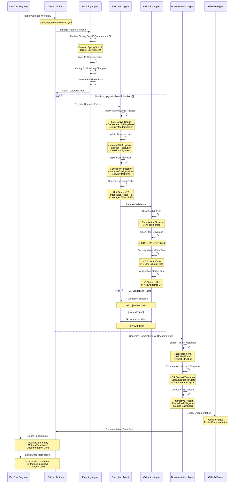
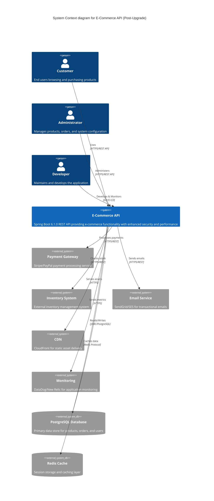
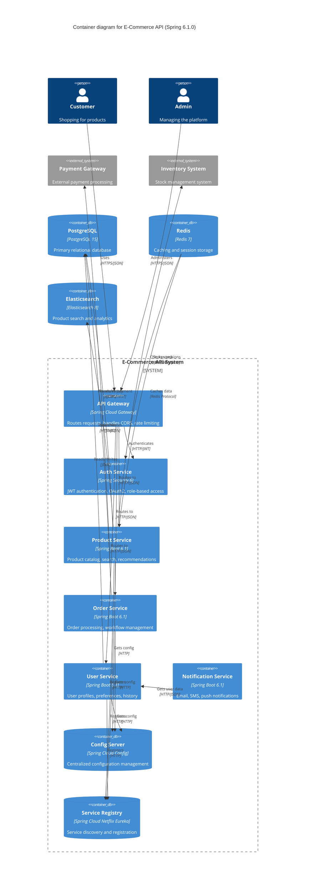
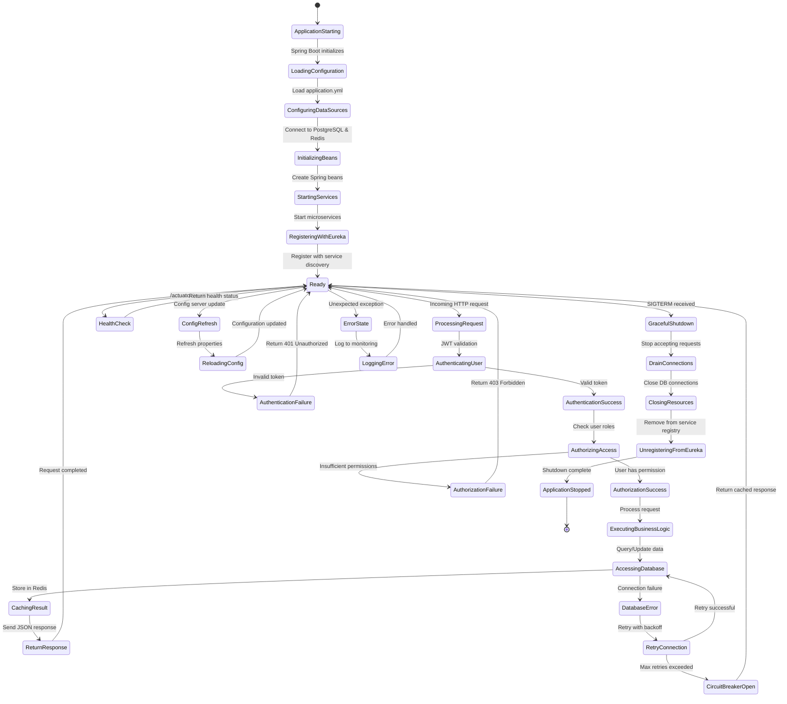
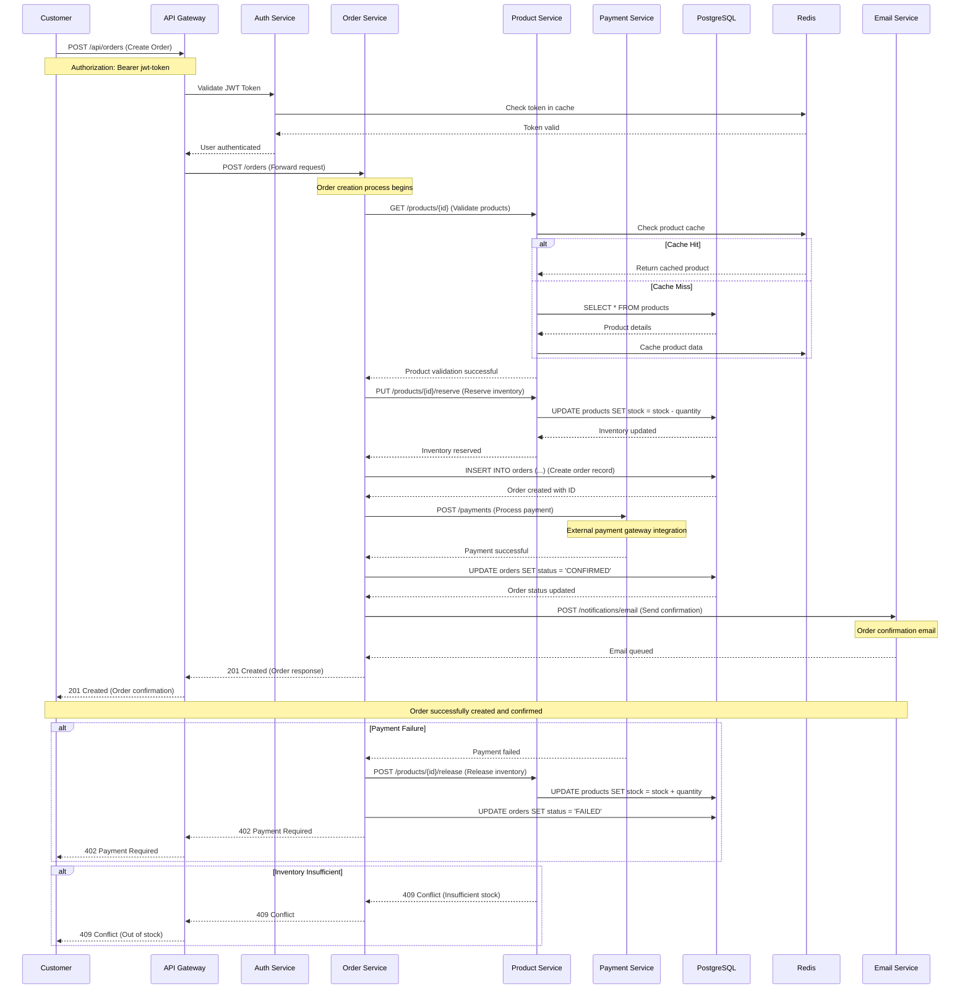

# Mermaid Diagram Examples for Spring Upgrade Documentation

## Sample Generated Diagrams

### 1. Upgrade Timeline Diagram
```mermaid
timeline
    title Spring Framework Upgrade Timeline - Project: E-Commerce API
    
    section Planning Phase
        2024-01-15 09:00 : Project Analysis Started
                         : Current Version: Spring 5.3.21
                         : Target Version: Spring 6.1.0
        2024-01-15 10:30 : Dependency Mapping Complete
                         : 45 Dependencies Analyzed
                         : 12 Breaking Changes Identified
        2024-01-15 11:45 : Risk Assessment Complete
                         : High Risk: 3 Components
                         : Medium Risk: 8 Components
        2024-01-15 12:00 : Upgrade Plan Generated
                         : 8 Phases Planned
                         : Estimated Duration: 4 hours
    
    section Execution Phase
        2024-01-15 13:00 : OpenRewrite Recipes Applied
                         : XML to Java Config Migration
                         : Deprecated API Updates
        2024-01-15 13:45 : Dependency Updates Complete
                         : Maven Dependencies Updated
                         : Version Conflicts Resolved
        2024-01-15 14:30 : Code Modernization Applied
                         : Constructor Injection Patterns
                         : Security Configuration Updates
        2024-01-15 15:15 : Test Generation Complete
                         : 23 New Unit Tests Added
                         : Coverage Increased to 84%
    
    section Validation Phase
        2024-01-15 15:30 : Build Validation Started
                         : Compilation Successful
                         : All Tests Passing
        2024-01-15 15:45 : Security Scan Complete
                         : 0 Critical Vulnerabilities
                         : 2 Low-Risk Issues Fixed
        2024-01-15 16:00 : Integration Tests Passed
                         : Application Startup: 12s
                         : All Endpoints Responding
        2024-01-15 16:15 : Final Validation Complete
                         : All Objectives Met
    
    section Documentation
        2024-01-15 16:30 : Architecture Analysis Started
                         : Component Mapping
                         : Diagram Generation
        2024-01-15 17:00 : Report Generation Complete
                         : HTML Report Generated
                         : Documentation Published
```

### 2. Execution Sequence Diagram


### 3. C4 Context Diagram Example


### 4. C4 Container Diagram Example


### 5. Class Diagram Example
```mermaid
classDiagram
    %% Controllers
    class ProductController {
        <<@RestController>>
        -ProductService productService
        +getProducts(Pageable) ResponseEntity~List~Product~~
        +getProduct(Long) ResponseEntity~Product~
        +createProduct(Product) ResponseEntity~Product~
        +updateProduct(Long, Product) ResponseEntity~Product~
        +deleteProduct(Long) ResponseEntity~Void~
        +searchProducts(String) ResponseEntity~List~Product~~
    }
    
    class OrderController {
        <<@RestController>>
        -OrderService orderService
        +getOrders(Pageable) ResponseEntity~List~Order~~
        +getOrder(Long) ResponseEntity~Order~
        +createOrder(OrderRequest) ResponseEntity~Order~
        +updateOrderStatus(Long, OrderStatus) ResponseEntity~Order~
        +cancelOrder(Long) ResponseEntity~Void~
    }
    
    class UserController {
        <<@RestController>>
        -UserService userService
        +getProfile() ResponseEntity~User~
        +updateProfile(UserUpdateRequest) ResponseEntity~User~
        +getUserOrders() ResponseEntity~List~Order~~
        +changePassword(PasswordChangeRequest) ResponseEntity~Void~
    }
    
    %% Services
    class ProductService {
        <<@Service>>
        -ProductRepository productRepository
        -ElasticsearchService searchService
        -CacheManager cacheManager
        +findAll(Pageable) Page~Product~
        +findById(Long) Optional~Product~
        +save(Product) Product
        +update(Long, Product) Product
        +delete(Long) void
        +search(String) List~Product~
        +updateInventory(Long, Integer) void
    }
    
    class OrderService {
        <<@Service>>
        -OrderRepository orderRepository
        -ProductService productService
        -PaymentService paymentService
        -NotificationService notificationService
        +createOrder(OrderRequest) Order
        +updateStatus(Long, OrderStatus) Order
        +cancelOrder(Long) void
        +processPayment(Long) PaymentResult
        +findUserOrders(Long) List~Order~
    }
    
    class UserService {
        <<@Service>>
        -UserRepository userRepository
        -PasswordEncoder passwordEncoder
        -JwtTokenProvider tokenProvider
        +findById(Long) Optional~User~
        +save(User) User
        +authenticate(LoginRequest) AuthResponse
        +updateProfile(Long, UserUpdateRequest) User
        +changePassword(Long, String) void
    }
    
    %% Repositories
    class ProductRepository {
        <<@Repository>>
        <<JpaRepository~Product, Long~>>
        +findByNameContaining(String) List~Product~
        +findByCategoryId(Long) List~Product~
        +findByPriceBetween(BigDecimal, BigDecimal) List~Product~
        +findAvailableProducts() List~Product~
    }
    
    class OrderRepository {
        <<@Repository>>
        <<JpaRepository~Order, Long~>>
        +findByUserId(Long) List~Order~
        +findByStatus(OrderStatus) List~Order~
        +findByCreatedDateBetween(LocalDateTime, LocalDateTime) List~Order~
    }
    
    class UserRepository {
        <<@Repository>>
        <<JpaRepository~User, Long~>>
        +findByEmail(String) Optional~User~
        +findByUsername(String) Optional~User~
        +existsByEmail(String) boolean
    }
    
    %% Entities
    class Product {
        <<@Entity>>
        -Long id
        -String name
        -String description
        -BigDecimal price
        -Integer stockQuantity
        -Category category
        -LocalDateTime createdDate
        -LocalDateTime updatedDate
        +getId() Long
        +getName() String
        +getPrice() BigDecimal
        +isAvailable() boolean
    }
    
    class Order {
        <<@Entity>>
        -Long id
        -User user
        -List~OrderItem~ items
        -BigDecimal totalAmount
        -OrderStatus status
        -LocalDateTime createdDate
        -LocalDateTime updatedDate
        +getId() Long
        +getUser() User
        +getTotalAmount() BigDecimal
        +addItem(OrderItem) void
    }
    
    class User {
        <<@Entity>>
        -Long id
        -String username
        -String email
        -String password
        -String firstName
        -String lastName
        -Set~Role~ roles
        -LocalDateTime createdDate
        -boolean enabled
        +getId() Long
        +getUsername() String
        +getEmail() String
        +getRoles() Set~Role~
    }
    
    class OrderItem {
        <<@Entity>>
        -Long id
        -Product product
        -Integer quantity
        -BigDecimal price
        +getId() Long
        +getProduct() Product
        +getQuantity() Integer
        +getSubtotal() BigDecimal
    }
    
    %% Relationships
    ProductController --> ProductService : uses
    OrderController --> OrderService : uses
    UserController --> UserService : uses
    
    ProductService --> ProductRepository : uses
    OrderService --> OrderRepository : uses
    OrderService --> ProductService : uses
    UserService --> UserRepository : uses
    
    Order ||--o{ OrderItem : contains
    OrderItem }o--|| Product : references
    Order }o--|| User : belongs to
    
    User ||--o{ Order : has many
    Product }o--|| Category : belongs to
```

### 6. State Diagram Example


### 7. Sequence Diagram for Order Processing


## Integration Instructions

### 1. Template Usage in Documentation Generator
```bash
# The documentation generator uses these templates
gh copilot agent documentation-generator \
    --task "generate-timeline" \
    --data "upgrade-reports/timeline-data.json" \
    --template "upgrade-config/templates/mermaid-templates/timeline-template.mmd" \
    --project-name "E-Commerce API" \
    --old-version "5.3.21" \
    --new-version "6.1.0"
```

### 2. HTML Report Integration
The generated Mermaid diagrams are embedded into the HTML report:
```html
<div class="mermaid">
{{TIMELINE_MERMAID}}
</div>
```

### 3. GitHub Pages Deployment
- Diagrams are automatically rendered in the deployed documentation
- Interactive features allow switching between different diagram views
- Print-friendly versions are available for offline documentation

These examples demonstrate the comprehensive documentation capabilities of the enhanced Spring upgrade system, providing visual representations of the upgrade process, system architecture, and application flow.