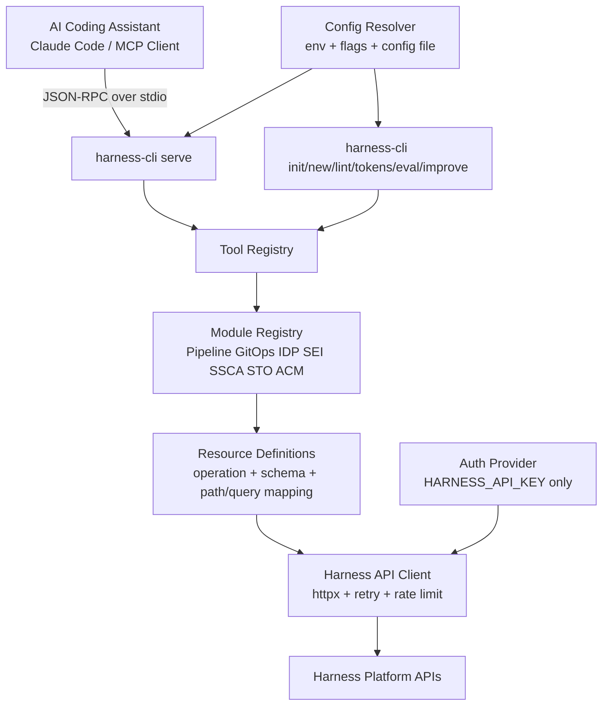

## :dart: Overview
`harness-cli` is a Python 3.11+ developer CLI and MCP server runtime that mirrors the Harness MCP server operating model while using a Python-first implementation stack. It exposes a compact, high-leverage tool surface for AI coding assistants and dispatches requests to Harness APIs using declarative resource definitions grouped by module. The design prioritizes deterministic behavior, strict schema validation, low token overhead, and safe-by-default write operations. It supports local and automated workflows via seven CLI subcommands (`init`, `new`, `lint`, `tokens`, `serve`, `eval`, `improve`) and MCP JSON-RPC over stdio for assistant integration. The implementation is self-contained so a developer can build, test, and ship `harness-cli` from this document alone.

## :building_construction: Architecture


### Module dependency summary
- `cli` depends on `core.config`, `core.registry`, `core.output`, and command handlers.
- `core.registry` depends on `modules.*` definitions and `core.client`.
- `core.client` depends on `core.auth`, `core.scope`, and retry/rate-limit utilities.
- `server.mcp_stdio` depends on `core.registry` and `core.validation`.
- `commands.eval` and `commands.improve` depend on `core.loader`, `core.lint`, and model adapters.

## :toolbox: Tech Stack
Fixed choices from the Python build references are mandatory.

| Concern | Fixed choice | Notes |
|---|---|---|
| Language | Python >= 3.11 | Required baseline |
| CLI framework | `typer` | Type-hint-native command ergonomics |
| Schema library | `pydantic` v2 | Input models + JSON Schema |
| MCP SDK | `mcp` (official Python SDK) | JSON-RPC server over stdio |
| HTTP client | `httpx` | Async client with timeouts |
| Rich output | `rich` | Human-readable default output |
| Config | `tomllib` + Pydantic model | `harness-cli.toml` |
| Lint/testing | `ruff`, `mypy --strict`, `pytest`, `pytest-asyncio`, `respx` | Deterministic CI |
| Packaging | `hatchling` + PEP 621 | Publishable wheel |
| Env manager | `uv` (fallback `pip`) | Reproducible local workflow |

## :open_file_folder: Project Structure
```text
harness-cli/
  src/harness_cli/
    __init__.py
    __main__.py
    cli.py
    commands/
      init.py
      new.py
      lint.py
      tokens.py
      serve.py
      eval.py
      improve.py
    core/
      config.py
      auth.py
      scope.py
      output.py
      errors.py
      loader.py
      tool_decorator.py
      module_registry.py
      tool_registry.py
      lint/
        runner.py
        naming_rules.py
        schema_rules.py
        description_rules.py
        response_rules.py
      eval_runner.py
      token_counter.py
    server/
      mcp_stdio.py
    client/
      harness_client.py
      dto.py
    modules/
      pipeline.py
      gitops.py
      idp.py
      sei.py
      ssca.py
      sto.py
      acm.py
      module_interface.py
    prompts/
      prompt_catalog.py
      templates/*.md
  tests/
    test_cli.py
    test_registry.py
    test_tools_*.py
    test_eval.py
    fixtures/
  pyproject.toml
  ruff.toml
  mypy.ini
  harness-cli.toml
  README.md
```

## :gear: Configuration
### `McpServerConfig` equivalent
```toml
# harness-cli.toml
model = "claude-opus-4-7"
response_token_limit = 25000
api_timeout_ms = 30000
max_retries = 3
rate_limit_rps = 10

[scope]
account_id = ""
org_id = "default"
project_id = ""

[module_flags]
pipeline = true
gitops = true
idp = true
sei = true
ssca = true
sto = true
acm = true

[lint.rules]
TS003 = "warn"
TS105 = "info"
```

### Environment variables
- `HARNESS_API_KEY` (required, API key/PAT)
- `HARNESS_ACCOUNT_ID` (optional; inferred from PAT if available)
- `HARNESS_ORG` (optional default org)
- `HARNESS_PROJECT` (optional default project)
- `HARNESS_BASE_URL` (optional, default `https://app.harness.io`)
- `HARNESS_API_TIMEOUT_MS`, `HARNESS_MAX_RETRIES`, `HARNESS_RATE_LIMIT_RPS`
- `HARNESS_MODULES` (optional enable/disable expression, e.g. `+sei,-sto`)
- `HARNESS_READ_ONLY` (optional safety gate)

### CLI flags
- Global: `--json`, `--cwd`, `--debug`, `--config`, `--account-id`, `--org-id`, `--project-id`, `--api-key`
- `serve`: `--transport stdio`, `--read-only`

### Precedence rules
1. Per-command flags
2. Environment variables
3. `harness-cli.toml`
4. Built-in defaults

## :closed_lock_with_key: Authentication and Scope
### API key provider
- Only API-key-based auth is allowed.
- Primary source: `HARNESS_API_KEY` env var.
- Optional override: `--api-key` flag for single command invocation.
- Never persist secrets in config files.

### Scope resolution and forwarding
All API-bound tool inputs support `account_id`, `org_id`, `project_id`.

Resolution order per field:
1. Explicit tool-call parameter
2. CLI flag (`--account-id/--org-id/--project-id`)
3. Env (`HARNESS_ACCOUNT_ID`, `HARNESS_ORG`, `HARNESS_PROJECT`)
4. Config file values
5. Derived value (for account from PAT)

### Missing credential and scope errors
Error shape must be actionable:
```text
toolsmith: missing required authentication
  cause: HARNESS_API_KEY is not set and no --api-key was provided
  fix:   export HARNESS_API_KEY=pat.<account>.<token>.<secret> and retry
```

## :puzzle_piece: Module System
### `Module` interface
```python
from typing import Protocol
from harness_cli.core.tool_decorator import ToolDefinition

class Module(Protocol):
    name: str
    enabled_by_default: bool

    def register_tools(self) -> list[ToolDefinition]:
        ...
```

### `ModuleRegistry`
- Loads all built-in modules: `pipeline`, `gitops`, `idp`, `sei`, `ssca`, `sto`, `acm`.
- Applies module filter expression from config/env.
- Exposes:
  - `enabled_modules()`
  - `enabled_tool_definitions()`
  - `describe()` for discovery and diagnostics.

### Enable/disable mechanism
- Explicit list mode: `pipeline,gitops,idp`
- Additive/subtractive mode: `+sei,-sto`
- Invalid module names are fatal with clear guidance.

### License validation hook
- Optional preflight hook `validate_harness_license_features()` runs at startup.
- Produces module-specific warnings if entitlement is missing (non-fatal for read-only metadata calls).

## :computer: Tool Definitions
The Harness reference server uses 11 generic MCP tools over many resource types.
`harness-cli` keeps that model and provides module-focused aliases for improved agent precision.

### Canonical tool mapping from Harness MCP
| Harness MCP tool | Python handler |
|---|---|
| `harness_describe` | `harness_describe_tool` |
| `harness_schema` | `harness_schema_tool` |
| `harness_list` | `harness_list_tool` |
| `harness_get` | `harness_get_tool` |
| `harness_create` | `harness_create_tool` |
| `harness_update` | `harness_update_tool` |
| `harness_delete` | `harness_delete_tool` |
| `harness_execute` | `harness_execute_tool` |
| `harness_search` | `harness_search_tool` |
| `harness_diagnose` | `harness_diagnose_tool` |
| `harness_status` | `harness_status_tool` |

### Tool format contract (applies to every tool)
- `name`: lowercase snake_case with namespace prefix.
- `description`: includes purpose, when-to-use, when-NOT-to-use, return shape.
- `input_schema`: generated from Pydantic model.
- `handler` signature: `async def tool_name(input: InputModel) -> dict | list`.
- `meta` (optional): namespace, version, tags, module.

### Pipeline module
Module description: CI/CD pipelines, executions, triggers, input sets, approvals.

| name | description | input_schema | handler signature | meta |
|---|---|---|---|---|
| `pipeline_list` | List pipeline resources with paging and filters. Use for discovery. Do NOT use for diagnostics. Returns paginated items. | object `{resource_type, account_id?, org_id?, project_id?, page?, size?, search_term?, filters?}` | `async def pipeline_list(input: PipelineListInput) -> dict` | `{module:"pipeline", tags:["list"]}` |
| `pipeline_get` | Get one pipeline resource by identifier. Use for detail inspection. Do NOT use for broad search. Returns single resource payload. | object `{resource_type, resource_id, account_id?, org_id?, project_id?, params?}` | `async def pipeline_get(input: PipelineGetInput) -> dict` | `{module:"pipeline", tags:["get"]}` |
| `pipeline_create` | Create a pipeline resource safely. Use for new objects. Do NOT use for updates. Returns created resource metadata. | object `{resource_type, body, account_id?, org_id?, project_id?, params?, confirmation?}` | `async def pipeline_create(input: PipelineCreateInput) -> dict` | `{module:"pipeline", tags:["create"]}` |
| `pipeline_update` | Update existing pipeline resource. Use for controlled edits. Do NOT use for create/delete. Returns updated metadata. | object `{resource_type, resource_id, body, account_id?, org_id?, project_id?, params?}` | `async def pipeline_update(input: PipelineUpdateInput) -> dict` | `{module:"pipeline", tags:["update"]}` |
| `pipeline_delete` | Delete pipeline resource with safety controls. Use for removal workflows. Do NOT use for interruption of executions. Returns deletion status. | object `{resource_type, resource_id, account_id?, org_id?, project_id?, params?, confirmation?}` | `async def pipeline_delete(input: PipelineDeleteInput) -> dict` | `{module:"pipeline", tags:["delete"]}` |
| `pipeline_execute` | Execute pipeline actions (run/retry/interrupt). Use for runtime operations. Do NOT use for YAML authoring. Returns action result and identifiers. | object `{resource_type, action, resource_id, account_id?, org_id?, project_id?, inputs?}` | `async def pipeline_execute(input: PipelineRunInput) -> dict` | `{module:"pipeline", tags:["execute"]}` |
| `pipeline_diagnose` | Diagnose pipeline failures with context/log hints. Use for troubleshooting. Do NOT use for standard listing. Returns diagnosis summary and findings. | object `{execution_id?, pipeline_id?, account_id?, org_id?, project_id?, summary?, include_logs?}` | `async def pipeline_diagnose(input: PipelineDiagnoseInput) -> dict` | `{module:"pipeline", tags:["diagnose"]}` |

```python
from pydantic import BaseModel, Field
from typing import Any, Literal
from harness_cli.core.tool_decorator import tool

class PipelineRunInput(BaseModel):
    account_id: str | None = Field(None, description="Harness account identifier override")
    org_id: str | None = Field(None, description="Organization identifier override")
    project_id: str | None = Field(None, description="Project identifier override")
    resource_type: Literal["pipeline", "pipeline_v1"] = Field(..., description="Pipeline resource type")
    action: Literal["run", "retry", "interrupt"] = Field(..., description="Execution action")
    resource_id: str = Field(..., description="Pipeline identifier")
    inputs: dict[str, Any] | None = Field(None, description="Runtime input values for the run")

@tool(
    name="pipeline_execute",
    description="""
Execute a pipeline action in Harness.
Use when: starting or controlling pipeline runs (run, retry, interrupt).
Do NOT use when: creating/updating pipeline YAML; use pipeline_create/pipeline_update.
Returns: execution metadata including execution_id, status, timestamps, and deep links.
""",
    input_model=PipelineRunInput,
    meta={"module": "pipeline", "version": "1.0.0"},
)
async def pipeline_execute(input: PipelineRunInput) -> dict:
    return await dispatch_to_registry("pipeline", "execute", input.model_dump(exclude_none=True))
```

```python
class PipelineDiagnoseInput(BaseModel):
    account_id: str | None = Field(None, description="Harness account identifier override")
    org_id: str | None = Field(None, description="Organization identifier override")
    project_id: str | None = Field(None, description="Project identifier override")
    execution_id: str | None = Field(None, description="Execution identifier to diagnose")
    pipeline_id: str | None = Field(None, description="Pipeline identifier if execution_id is unavailable")
    summary: bool = Field(True, description="Return summary mode when true; detailed diagnostics when false")
    include_logs: bool = Field(True, description="Include failed step log snippets")

@tool(
    name="pipeline_diagnose",
    description="""
Diagnose pipeline failures and execution health.
Use when: you need root-cause context for failed or unstable runs.
Do NOT use when: only listing executions; use pipeline_list with resource_type=execution.
Returns: stage/step diagnostics, error summaries, delegate context, and suggested next actions.
""",
    input_model=PipelineDiagnoseInput,
    meta={"module": "pipeline", "version": "1.0.0"},
)
async def pipeline_diagnose(input: PipelineDiagnoseInput) -> dict:
    payload = input.model_dump(exclude_none=True)
    return await run_pipeline_diagnostics(payload)
```

### GitOps module
Module description: agents, applications, clusters, repositories, appsets, resource actions.

| name | description | input_schema | handler signature | meta |
|---|---|---|---|---|
| `gitops_list` | List GitOps resources for an agent/scope. Use for discovery. Do NOT use for sync actions. Returns paginated resources. | object `{resource_type, account_id?, org_id?, project_id?, agent_id?, search_term?, page?, size?}` | `async def gitops_list(input: GitOpsListInput) -> dict` | `{module:"gitops", tags:["list"]}` |
| `gitops_get` | Get one GitOps resource by id/context. Use for detailed inspection. Do NOT use for bulk search. Returns resource detail. | object `{resource_type, resource_id, account_id?, org_id?, project_id?, agent_id?, params?}` | `async def gitops_get(input: GitOpsGetInput) -> dict` | `{module:"gitops", tags:["get"]}` |
| `gitops_execute` | Execute GitOps action such as sync. Use for reconciliation workflows. Do NOT use for read-only inventory. Returns operation outcome. | object `{resource_type, action, resource_id?, account_id?, org_id?, project_id?, agent_id?, body?}` | `async def gitops_execute(input: GitOpsExecuteInput) -> dict` | `{module:"gitops", tags:["execute"]}` |
| `gitops_search` | Search across multiple GitOps resource types. Use for cross-type lookup. Do NOT use for exact-id retrieval. Returns ranked matches. | object `{query, account_id?, org_id?, project_id?, resource_types?, max_per_type?}` | `async def gitops_search(input: GitOpsSearchInput) -> dict` | `{module:"gitops", tags:["search"]}` |

```python
class GitOpsSyncInput(BaseModel):
    account_id: str | None = Field(None, description="Harness account identifier override")
    org_id: str | None = Field(None, description="Organization identifier override")
    project_id: str | None = Field(None, description="Project identifier override")
    resource_type: Literal["gitops_application"] = Field(..., description="GitOps application resource")
    action: Literal["sync"] = Field(..., description="Sync action")
    resource_id: str = Field(..., description="Application name")
    agent_id: str = Field(..., description="GitOps agent identifier")

@tool(
    name="gitops_execute_sync",
    description="""
Synchronize a GitOps application with its desired state.
Use when: reconciling drift or deploying manifest updates.
Do NOT use when: listing GitOps resources; use gitops_list.
Returns: sync operation result, status, and operation identifier.
""",
    input_model=GitOpsSyncInput,
    meta={"module": "gitops"},
)
async def gitops_execute_sync(input: GitOpsSyncInput) -> dict:
    return await dispatch_to_registry("gitops", "execute", input.model_dump(exclude_none=True))
```

```python
class GitOpsResourceTreeInput(BaseModel):
    account_id: str | None = Field(None, description="Harness account identifier override")
    org_id: str | None = Field(None, description="Organization identifier override")
    project_id: str | None = Field(None, description="Project identifier override")
    resource_type: Literal["gitops_app_resource_tree"] = Field(..., description="GitOps app tree resource type")
    resource_id: str = Field(..., description="Application name")
    agent_id: str = Field(..., description="GitOps agent identifier")

@tool(
    name="gitops_get_resource_tree",
    description="""
Retrieve managed resource topology for a GitOps application.
Use when: investigating health/drift by Kubernetes object hierarchy.
Do NOT use when: requesting pod logs; use gitops_get with gitops_pod_log.
Returns: resource graph/tree with status and sync metadata.
""",
    input_model=GitOpsResourceTreeInput,
    meta={"module": "gitops"},
)
async def gitops_get_resource_tree(input: GitOpsResourceTreeInput) -> dict:
    return await dispatch_to_registry("gitops", "get", input.model_dump(exclude_none=True))
```

### IDP module
Module description: entities, scorecards, checks, scores, workflows, tech docs.

| name | description | input_schema | handler signature | meta |
|---|---|---|---|---|
| `idp_list` | List IDP entities/scorecards/workflows. Use for catalog discovery. Do NOT use for workflow execution. Returns list payload. | object `{resource_type, account_id?, org_id?, project_id?, kind?, search?, namespace?, page?, size?}` | `async def idp_list(input: IdpListInput) -> dict` | `{module:"idp", tags:["list"]}` |
| `idp_get` | Retrieve one IDP resource by identifier. Use for entity detail analysis. Do NOT use for broad filtering. Returns detailed object. | object `{resource_type, resource_id, account_id?, org_id?, project_id?, kind?, params?}` | `async def idp_get(input: IdpGetInput) -> dict` | `{module:"idp", tags:["get"]}` |
| `idp_execute_workflow` | Execute an IDP workflow with inputs. Use for automation workflows. Do NOT use for static metadata requests. Returns execution result. | object `{resource_type, action, resource_id, account_id?, org_id?, project_id?, body?}` | `async def idp_execute_workflow(input: IdpWorkflowExecuteInput) -> dict` | `{module:"idp", tags:["execute"]}` |

```python
class IdpScorecardStatsInput(BaseModel):
    account_id: str | None = Field(None, description="Harness account identifier override")
    org_id: str | None = Field(None, description="Organization identifier override")
    project_id: str | None = Field(None, description="Project identifier override")
    resource_type: Literal["scorecard_stats"] = Field(..., description="IDP scorecard stats resource type")
    resource_id: str = Field(..., description="Scorecard identifier")

@tool(
    name="idp_get_scorecard_stats",
    description="""
Fetch compliance statistics for an IDP scorecard.
Use when: evaluating service quality posture and trend movement.
Do NOT use when: listing entities; use idp_list with idp_entity.
Returns: score distributions, pass/fail counts, and trend indicators.
""",
    input_model=IdpScorecardStatsInput,
    meta={"module": "idp"},
)
async def idp_get_scorecard_stats(input: IdpScorecardStatsInput) -> dict:
    return await dispatch_to_registry("idp", "get", input.model_dump(exclude_none=True))
```

```python
class IdpWorkflowExecuteInput(BaseModel):
    account_id: str | None = Field(None, description="Harness account identifier override")
    org_id: str | None = Field(None, description="Organization identifier override")
    project_id: str | None = Field(None, description="Project identifier override")
    resource_type: Literal["idp_workflow"] = Field(..., description="IDP workflow resource type")
    action: Literal["execute"] = Field(..., description="Workflow execution action")
    resource_id: str = Field(..., description="Workflow identifier")
    body: dict[str, Any] | None = Field(None, description="Workflow input payload")

@tool(
    name="idp_execute_workflow",
    description="""
Execute an IDP workflow.
Use when: automating platform tasks modeled as IDP workflows.
Do NOT use when: querying workflow catalog metadata only; use idp_list.
Returns: workflow execution id, status, and follow-up links.
""",
    input_model=IdpWorkflowExecuteInput,
    meta={"module": "idp"},
)
async def idp_execute_workflow(input: IdpWorkflowExecuteInput) -> dict:
    return await dispatch_to_registry("idp", "execute", input.model_dump(exclude_none=True))
```

### SEI module
Module description: DORA, productivity, teams, org trees, AI coding insight metrics.

| name | description | input_schema | handler signature | meta |
|---|---|---|---|---|
| `sei_list` | List SEI resources and metric families. Use for metric discovery. Do NOT use for single metric deep reads. Returns list data. | object `{resource_type, account_id?, org_id?, project_id?, date_start?, date_end?, granularity?, team_ref_id?, page?, size?}` | `async def sei_list(input: SeiListInput) -> dict` | `{module:"sei", tags:["list"]}` |
| `sei_get` | Get SEI metric/detail payloads by aspect/metric. Use for analytics retrieval. Do NOT use for free-text search. Returns metric response. | object `{resource_type, account_id?, org_id?, project_id?, aspect?, metric?, team_ref_id?, date_start?, date_end?, granularity?}` | `async def sei_get(input: SeiGetInput) -> dict` | `{module:"sei", tags:["get"]}` |
| `sei_search` | Search SEI resource types and categories. Use for discovery by keyword. Do NOT use for timeseries retrieval. Returns ranked type matches. | object `{query, account_id?, resource_types?, max_results?}` | `async def sei_search(input: SeiSearchInput) -> dict` | `{module:"sei", tags:["search"]}` |

```python
class SeiDoraInput(BaseModel):
    account_id: str | None = Field(None, description="Harness account identifier override")
    org_id: str | None = Field(None, description="Organization identifier override")
    project_id: str | None = Field(None, description="Project identifier override")
    resource_type: Literal["sei_dora_metric"] = Field(..., description="SEI DORA metric resource")
    metric: Literal[
        "deployment_frequency",
        "change_failure_rate",
        "mttr",
        "lead_time",
        "deployment_frequency_drilldown",
        "change_failure_rate_drilldown",
        "mttr_drilldown",
        "lead_time_drilldown",
    ] = Field(..., description="DORA metric selector")
    team_ref_id: str = Field(..., description="SEI team reference identifier")
    date_start: str = Field(..., description="Start date (YYYY-MM-DD)")
    date_end: str = Field(..., description="End date (YYYY-MM-DD)")
    granularity: Literal["day", "week", "month"] = Field("week", description="Time aggregation granularity")

@tool(
    name="sei_get_dora_metric",
    description="""
Retrieve DORA metrics from Software Engineering Insights.
Use when: measuring delivery performance and operational stability.
Do NOT use when: collecting IDP scorecards; use IDP module tools.
Returns: metric values and optional drilldown dimensions over time.
""",
    input_model=SeiDoraInput,
    meta={"module": "sei"},
)
async def sei_get_dora_metric(input: SeiDoraInput) -> dict:
    return await dispatch_to_registry("sei", "get", input.model_dump(exclude_none=True))
```

```python
class SeiAiUsageInput(BaseModel):
    account_id: str | None = Field(None, description="Harness account identifier override")
    org_id: str | None = Field(None, description="Organization identifier override")
    project_id: str | None = Field(None, description="Project identifier override")
    resource_type: Literal["sei_ai_usage"] = Field(..., description="SEI AI usage resource")
    aspect: Literal["metrics", "breakdown", "summary", "top_languages"] = Field(..., description="AI usage facet")
    team_ref_id: str | None = Field(None, description="Optional team scope")
    date_start: str = Field(..., description="Start date (YYYY-MM-DD)")
    date_end: str = Field(..., description="End date (YYYY-MM-DD)")

@tool(
    name="sei_get_ai_usage",
    description="""
Get AI coding assistant usage insights from SEI.
Use when: tracking adoption and behavioral usage trends.
Do NOT use when: requesting AI impact PR velocity/rework; use sei_ai_impact.
Returns: usage metrics, breakdowns, or summary views based on aspect.
""",
    input_model=SeiAiUsageInput,
    meta={"module": "sei"},
)
async def sei_get_ai_usage(input: SeiAiUsageInput) -> dict:
    return await dispatch_to_registry("sei", "get", input.model_dump(exclude_none=True))
```

### SSCA module
Module description: artifact sources, security posture, SBOM, chain of custody, compliance and remediation.

| name | description | input_schema | handler signature | meta |
|---|---|---|---|---|
| `ssca_list` | List SSCA artifact/security resources. Use for inventory and selection. Do NOT use for action execution. Returns paged items. | object `{resource_type, account_id?, org_id?, project_id?, source_id?, orchestration_id?, page?, size?, filters?}` | `async def ssca_list(input: SscaListInput) -> dict` | `{module:"ssca", tags:["list"]}` |
| `ssca_get` | Get one SSCA resource detail. Use for drilldown into artifact/compliance context. Do NOT use for list discovery. Returns detail payload. | object `{resource_type, resource_id?, account_id?, org_id?, project_id?, params?}` | `async def ssca_get(input: SscaGetInput) -> dict` | `{module:"ssca", tags:["get"]}` |
| `ssca_execute` | Execute SSCA actions (for example SBOM drift calculation). Use for server-side security workflows. Do NOT use for static reads. Returns operation result. | object `{resource_type, action, account_id?, org_id?, project_id?, resource_id?, body?, params?}` | `async def ssca_execute(input: SscaExecuteInput) -> dict` | `{module:"ssca", tags:["execute"]}` |

```python
class SscaArtifactSecurityInput(BaseModel):
    account_id: str | None = Field(None, description="Harness account identifier override")
    org_id: str | None = Field(None, description="Organization identifier override")
    project_id: str | None = Field(None, description="Project identifier override")
    resource_type: Literal["artifact_security"] = Field(..., description="SSCA artifact security resource")
    source_id: str = Field(..., description="Artifact source identifier")
    page: int = Field(0, ge=0, description="Zero-indexed page number")
    size: int = Field(20, ge=1, le=100, description="Page size")

@tool(
    name="ssca_list_artifact_security",
    description="""
List artifact security records from SSCA.
Use when: discovering scanned artifacts and selecting one for deeper checks.
Do NOT use when: requesting component-level details directly; use scs_artifact_component.
Returns: artifact list with orchestration/security summary fields.
""",
    input_model=SscaArtifactSecurityInput,
    meta={"module": "ssca"},
)
async def ssca_list_artifact_security(input: SscaArtifactSecurityInput) -> dict:
    return await dispatch_to_registry("ssca", "list", input.model_dump(exclude_none=True))
```

```python
class SscaSbomDriftInput(BaseModel):
    account_id: str | None = Field(None, description="Harness account identifier override")
    org_id: str | None = Field(None, description="Organization identifier override")
    project_id: str | None = Field(None, description="Project identifier override")
    resource_type: Literal["scs_sbom_drift"] = Field(..., description="SSCA SBOM drift resource")
    action: Literal["calculate"] = Field(..., description="Drift calculation action")
    orchestration_id: str = Field(..., description="Artifact orchestration identifier")
    base: Literal["last_generated_sbom", "baseline", "repository"] = Field(..., description="Comparison baseline type")
    variant: dict[str, Any] | None = Field(None, description="Optional baseline variant payload")

@tool(
    name="ssca_execute_sbom_drift_calculate",
    description="""
Calculate SBOM drift for an artifact.
Use when: comparing package changes between builds or baselines.
Do NOT use when: listing artifacts; use ssca_list_artifact_security first.
Returns: drift identifier and summary suitable for follow-up component drift queries.
""",
    input_model=SscaSbomDriftInput,
    meta={"module": "ssca"},
)
async def ssca_execute_sbom_drift_calculate(input: SscaSbomDriftInput) -> dict:
    return await dispatch_to_registry("ssca", "execute", input.model_dump(exclude_none=True))
```

### STO module
Module description: security issues, issue filters, exemptions with approval actions.

| name | description | input_schema | handler signature | meta |
|---|---|---|---|---|
| `sto_list` | List STO issues/exemptions with filters. Use for triage queues. Do NOT use for status-changing actions. Returns filtered list. | object `{resource_type, account_id?, org_id?, project_id?, severity?, status?, page?, size?}` | `async def sto_list(input: StoListInput) -> dict` | `{module:"sto", tags:["list"]}` |
| `sto_get` | Get a specific STO issue/exemption context. Use for detailed decisioning. Do NOT use for broad inventory. Returns full record. | object `{resource_type, resource_id, account_id?, org_id?, project_id?, params?}` | `async def sto_get(input: StoGetInput) -> dict` | `{module:"sto", tags:["get"]}` |
| `sto_execute` | Execute exemption workflow action (approve/reject/promote). Use for governance flow. Do NOT use for issue listing. Returns updated status payload. | object `{resource_type, action, resource_id, account_id?, org_id?, project_id?, body?}` | `async def sto_execute(input: StoExemptionActionInput) -> dict` | `{module:"sto", tags:["execute"]}` |

```python
class StoSecurityIssueInput(BaseModel):
    account_id: str | None = Field(None, description="Harness account identifier override")
    org_id: str | None = Field(None, description="Organization identifier override")
    project_id: str | None = Field(None, description="Project identifier override")
    resource_type: Literal["security_issue"] = Field(..., description="STO security issue resource")
    page: int = Field(0, ge=0, description="Zero-indexed page number")
    size: int = Field(20, ge=1, le=100, description="Page size")
    severity: Literal["critical", "high", "medium", "low"] | None = Field(None, description="Optional severity filter")

@tool(
    name="sto_list_security_issues",
    description="""
List security issues from STO.
Use when: triaging vulnerabilities and prioritizing remediation.
Do NOT use when: looking up valid filter dimensions; use security_issue_filter.
Returns: issue list with severity, status, and source scanner context.
""",
    input_model=StoSecurityIssueInput,
    meta={"module": "sto"},
)
async def sto_list_security_issues(input: StoSecurityIssueInput) -> dict:
    return await dispatch_to_registry("sto", "list", input.model_dump(exclude_none=True))
```

```python
class StoExemptionActionInput(BaseModel):
    account_id: str | None = Field(None, description="Harness account identifier override")
    org_id: str | None = Field(None, description="Organization identifier override")
    project_id: str | None = Field(None, description="Project identifier override")
    resource_type: Literal["security_exemption"] = Field(..., description="STO exemption resource")
    action: Literal["approve", "reject", "promote"] = Field(..., description="Exemption action")
    resource_id: str = Field(..., description="Exemption identifier")
    body: dict[str, Any] | None = Field(None, description="Optional action payload (comment/reason)")

@tool(
    name="sto_execute_security_exemption_action",
    description="""
Apply an approval workflow action to a security exemption.
Use when: completing governance decisions on pending exemptions.
Do NOT use when: listing pending exemptions; use sto_list with security_exemption.
Returns: updated exemption status and audit metadata.
""",
    input_model=StoExemptionActionInput,
    meta={"module": "sto"},
)
async def sto_execute_security_exemption_action(input: StoExemptionActionInput) -> dict:
    return await dispatch_to_registry("sto", "execute", input.model_dump(exclude_none=True))
```

### ACM module
Module description: users, groups, service accounts, roles, assignments, resource groups, permissions.

| name | description | input_schema | handler signature | meta |
|---|---|---|---|---|
| `acm_list` | List users/groups/roles and related RBAC resources. Use for IAM discovery. Do NOT use for mutations. Returns paginated objects. | object `{resource_type, account_id?, org_id?, project_id?, search_term?, page?, size?, filters?}` | `async def acm_list(input: AcmListInput) -> dict` | `{module:"acm", tags:["list"]}` |
| `acm_get` | Get one ACM resource by identifier. Use for detail checks. Do NOT use for search workflows. Returns resource detail. | object `{resource_type, resource_id, account_id?, org_id?, project_id?, params?}` | `async def acm_get(input: AcmGetInput) -> dict` | `{module:"acm", tags:["get"]}` |
| `acm_create` | Create ACM resource (role, assignment, group, service account). Use for permission provisioning. Do NOT use for updates. Returns created metadata. | object `{resource_type, body, account_id?, org_id?, project_id?, params?}` | `async def acm_create(input: AcmCreateInput) -> dict` | `{module:"acm", tags:["create"]}` |
| `acm_update` | Update ACM resource. Use for role/group modifications. Do NOT use for create/delete. Returns updated metadata. | object `{resource_type, resource_id, body, account_id?, org_id?, project_id?, params?}` | `async def acm_update(input: AcmUpdateInput) -> dict` | `{module:"acm", tags:["update"]}` |
| `acm_delete` | Delete ACM resource safely. Use for controlled IAM cleanup. Do NOT use for temporary disable semantics. Returns deletion confirmation. | object `{resource_type, resource_id, account_id?, org_id?, project_id?, params?, confirmation?}` | `async def acm_delete(input: AcmDeleteInput) -> dict` | `{module:"acm", tags:["delete"]}` |

```python
class AcmListRolesInput(BaseModel):
    account_id: str | None = Field(None, description="Harness account identifier override")
    org_id: str | None = Field(None, description="Organization identifier override")
    project_id: str | None = Field(None, description="Project identifier override")
    resource_type: Literal["role"] = Field(..., description="Access control role resource")
    search_term: str | None = Field(None, description="Optional role search term")
    page: int = Field(0, ge=0, description="Zero-indexed page number")
    size: int = Field(20, ge=1, le=100, description="Page size")

@tool(
    name="acm_list_roles",
    description="""
List RBAC roles in Harness.
Use when: auditing available role definitions and permissions.
Do NOT use when: fetching permissions catalog; use acm_list with permission resource.
Returns: paginated role definitions with identifiers and metadata.
""",
    input_model=AcmListRolesInput,
    meta={"module": "acm"},
)
async def acm_list_roles(input: AcmListRolesInput) -> dict:
    return await dispatch_to_registry("acm", "list", input.model_dump(exclude_none=True))
```

```python
class AcmCreateRoleAssignmentInput(BaseModel):
    account_id: str | None = Field(None, description="Harness account identifier override")
    org_id: str | None = Field(None, description="Organization identifier override")
    project_id: str | None = Field(None, description="Project identifier override")
    resource_type: Literal["role_assignment"] = Field(..., description="Role assignment resource")
    body: dict[str, Any] = Field(..., description="Role assignment payload including principal, role, and resource group")

@tool(
    name="acm_create_role_assignment",
    description="""
Create a role assignment in Harness access control.
Use when: granting role-based permissions to a user/group/service account.
Do NOT use when: creating role definitions; use acm_create with role resource.
Returns: assignment identifier and effective scope details.
""",
    input_model=AcmCreateRoleAssignmentInput,
    meta={"module": "acm"},
)
async def acm_create_role_assignment(input: AcmCreateRoleAssignmentInput) -> dict:
    return await dispatch_to_registry("acm", "create", input.model_dump(exclude_none=True))
```

## :electric_plug: Harness API Client Layer
### Abstract client interface
```python
from typing import Any, Protocol

class HarnessApiClient(Protocol):
    async def request(
        self,
        method: str,
        path: str,
        *,
        params: dict[str, Any] | None = None,
        json_body: dict[str, Any] | None = None,
        headers: dict[str, str] | None = None,
    ) -> dict[str, Any]:
        ...
```

### Service class skeletons
- `PipelineService`, `GitOpsService`, `IdpService`, `SeiService`, `SscaService`, `StoService`, `AcmService`
- Each service delegates request construction to declarative resource specs.

### DTO model examples
- `PipelineExecutionDto`, `GitOpsApplicationDto`, `IdpScorecardDto`, `SeiMetricDto`, `SscaArtifactDto`, `StoIssueDto`, `RoleAssignmentDto`

### API surfaces needing Python equivalents
- Pipeline: `/pipeline/api/*`
- GitOps: `/gitops/api/v1/*`
- IDP: `/v1/entities` and scorecard/workflow APIs
- SEI: `/gateway/sei/api/*`
- SSCA: `/ssca-manager/*`
- STO: `/sto/api/v2/*`
- ACM: `/ng/api`, `/authz/api`, `/resourcegroup/api`

## :pager: CLI Subcommands
All commands support `--json` and return `0/1/2/3` according to toolsmith conventions.

### `init`
- Purpose: scaffold a new `harness-cli` project.
- Flags: `--force`, `--no-install`.
- Output contract: paths created + next steps.
- Exit codes: `0` success, `2` on existing files without `--force`.

Example session:
```text
$ harness-cli init demo
Created harness-cli project in ./demo
$ cd demo
$ harness-cli lint
0 errors, 0 warnings
```

### `new`
- Purpose: scaffold a new module tool file.
- Flags: `--description`, `--force`.
- Validates TS001/TS002 naming at creation time.

### `lint`
- Purpose: apply TS001-TS302 rule set.
- Flags: `--rule`, `--fix`.
- Exit `1` if any error severity diagnostics.

### `tokens`
- Purpose: report token costs for names, descriptions, schemas, and optional samples.
- Flags: `--model`, `--response`, `--fail-over`, `--no-cache`.

### `serve`
- Purpose: run MCP JSON-RPC server over stdio.
- Flags: `--transport stdio`, `--read-only`.
- Prints `claude mcp add` connection hint.

### `eval`
- Purpose: run task-based agentic evaluations against loaded tools.
- Flags: `--filter`, `--concurrency`, `--max-iterations`, `--timeout`.
- Exit `1` if any task fails.

### `improve`
- Purpose: generate targeted tool-definition improvements from lint+principles context.
- Flags: `--write`, `--json`.
- Must never modify handler business logic automatically.

## :satellite: JSON-RPC stdio Server
### Startup sequence
1. Load config and resolve auth/scope defaults.
2. Build `ModuleRegistry` and `ToolRegistry` from enabled modules.
3. Register all tools on MCP server with `name`, `description`, `inputSchema`.
4. Start stdio transport loop.

### Call handling
1. Validate incoming params with Pydantic model.
2. Resolve scope precedence.
3. Dispatch to module service.
4. Normalize response and enforce token cap.
5. Return structured tool result or structured error.

### Graceful shutdown
- SIGINT/SIGTERM drains in-flight calls.
- Flushes metrics/logs and exits with `0`.

## :memo: Prompts and AI Guidance
`harness-cli` provides prompt templates analogous to Harness prompt registration, but packaged as prompt assets for `eval`/`improve` and optional MCP prompt exposure.

Prompt families:
- DevOps: deploy app, debug pipeline, pending approvals.
- FinOps: optimize costs, anomaly investigation.
- DevSecOps: vulnerability triage, exemption review.
- Developer Platform: IDP scorecard, access-control audit.

Design constraints:
- Prompt templates are optional at runtime and must not block tool execution.
- Prompts reference only enabled modules.

## :clipboard: Lint Rules Applied
| Rule band | Enforcement in `harness-cli` |
|---|---|
| TS001-TS005 | Name regex, namespace prefix, duplicate/near-duplicate detection |
| TS100-TS106 | Object-root schema, per-field descriptions, enum hygiene, depth and pagination checks |
| TS200-TS203 | Description length, use/disambiguation sections, token budget, return-shape mention |
| TS300-TS302 | Sample response token budget, opaque-id warning, actionable error guidance checks |

### Additional enforcement notes
- All tool names in this spec are snake_case and namespaced.
- All descriptions in examples include the four-part pattern.
- All Pydantic fields include descriptions.

## :test_tube: Testing Strategy
### Unit tests
- `tests/test_registry.py`: module/resource registration, enable/disable, scope rules.
- `tests/test_tools_*.py`: schema validation and dispatch correctness per module.
- `tests/test_client.py`: retry/backoff/rate-limit and error normalization.

### Mock HTTP patterns
- Use `respx` to mock module endpoint variants and failure modes (`429`, `5xx`, malformed payloads).
- Snapshot normalized tool responses for deterministic regression checks.

### Eval fixture format
```json
{
  "tasks": [
    {
      "id": "pipeline-failure-triage",
      "prompt": "Find why the latest execution failed for pipeline X",
      "expected_tools": ["pipeline_list", "pipeline_diagnose"],
      "verifier": { "type": "tool_called", "value": "pipeline_diagnose" }
    }
  ]
}
```

### CI pipeline steps
1. `uv sync`
2. `ruff check src tests`
3. `mypy --strict src`
4. `pytest -q`
5. `harness-cli lint tests/fixtures/tools --json`
6. Optional nightly: `harness-cli eval evals/smoke.json`

## :white_check_mark: Acceptance Criteria
Checklist extends harness acceptance references and Harness-specific parity:

### Decomposed implementation tasks
1. Create project scaffold, packaging, and strict typing/linting baseline.
2. Implement config/auth/scope resolution with precedence and validation.
3. Implement module interfaces and module registry with enable/disable filtering.
4. Implement shared tool decorator and schema export pipeline.
5. Implement Harness API client with retries, throttling, and structured errors.
6. Implement Pipeline module toolset and representative endpoint mappings.
7. Implement GitOps module toolset and action handlers.
8. Implement IDP module toolset and workflow execution path.
9. Implement SEI module toolset with polymorphic metric/aspect routing.
10. Implement SSCA module toolset with SBOM/compliance/drift workflows.
11. Implement STO module toolset with issue and exemption action support.
12. Implement ACM module toolset for RBAC resources.
13. Implement seven CLI subcommands and global output contracts.
14. Implement stdio MCP server wiring and graceful shutdown.
15. Implement lint (TS001-TS302), tokens, eval, and improve flows.
16. Build test fixtures, CI pipeline, and parity validation against Harness MCP.

- [ ] Seven subcommands exist and match contracts.
- [ ] `serve` exposes JSON-RPC stdio tools compatible with `claude mcp add`.
- [ ] API key auth uses only `HARNESS_API_KEY` + optional CLI override.
- [ ] Scope precedence is implemented and documented.
- [ ] Each required module (Pipeline, GitOps, IDP, SEI, SSCA, STO, ACM) is independently toggleable.
- [ ] TS001-TS302 lint rules implemented and configurable.
- [ ] `--json` output valid for every command.
- [ ] Exit codes: `0` success, `1` validation failure, `2` user error, `3` internal error.
- [ ] Read-only mode blocks create/update/delete/execute.
- [ ] `harness-cli eval` writes transcripts and never crashes on task failure.
- [ ] Representative module tools in this spec compile with Pydantic + decorator contracts.

## :question: Open Questions
1. The upstream request mentions a Go source mapping, while current Harness MCP reference implementation is TypeScript. Should parity target the current TypeScript mainline as source of truth?
2. For hosted Harness MCP OAuth mode, should `harness-cli` intentionally remain API-key-only (as required) and ignore OAuth, or provide explicit non-support messaging in diagnostics?
3. For SEI polymorphic endpoints (`metric`/`aspect`/`action`), should strict enums be version-pinned or fetched dynamically from discovery endpoints?
4. For pipeline remote updates, should `last_object_id` and `last_commit_id` be auto-resolved by preflight GET when absent?
5. For SSCA SBOM format handling, should response normalization expose explicit `format` metadata (`CycloneDX`, `SPDX`, or custom)?
6. For STO `promote` exemption action, what exact lifecycle semantics must be represented in user-facing result messages?
7. For GitOps multi-scope agent IDs (`account.<id>`, `org.<id>`, project-scoped plain ID), should the Python client auto-normalize or require explicit caller format?
8. Should visual/chart resource concepts be included in v1 parity for these seven required modules, or deferred as optional extension modules?
9. Should elicitation-equivalent confirmation be implemented as MCP utility prompts only, or also as local CLI confirmation fallback for non-interactive clients?
10. Should module capability detection (license/entitlement) be hard-fail, soft-warn, or lazy-fail per call?
